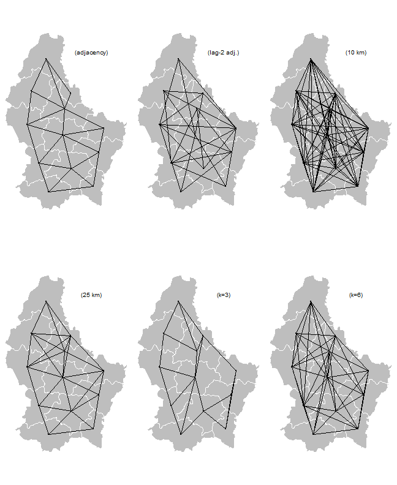
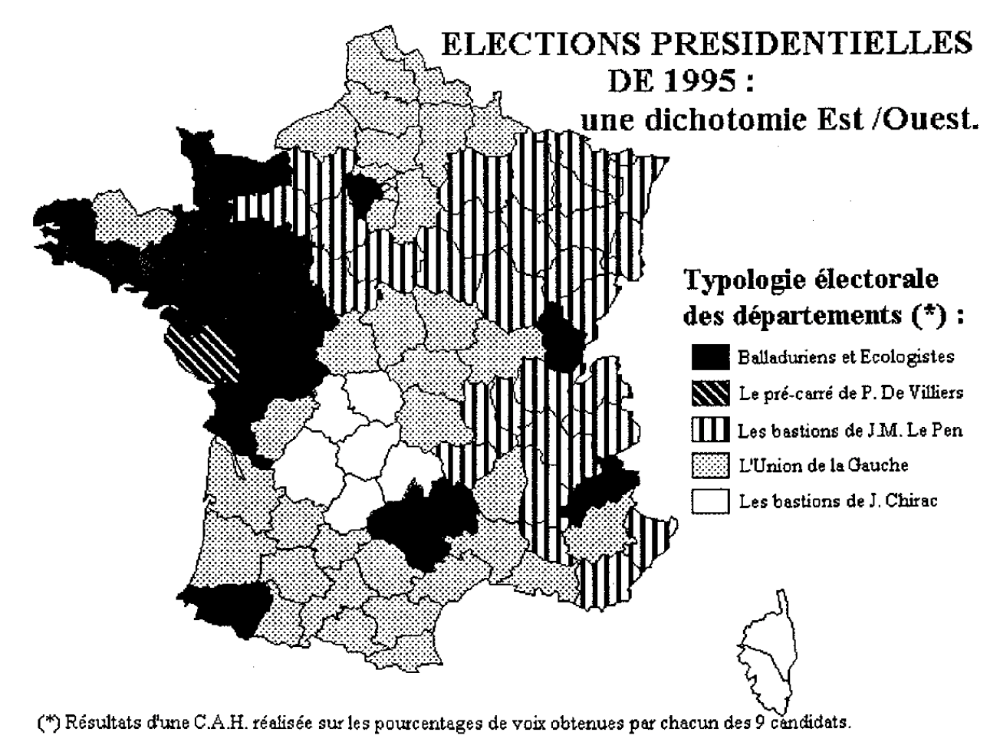
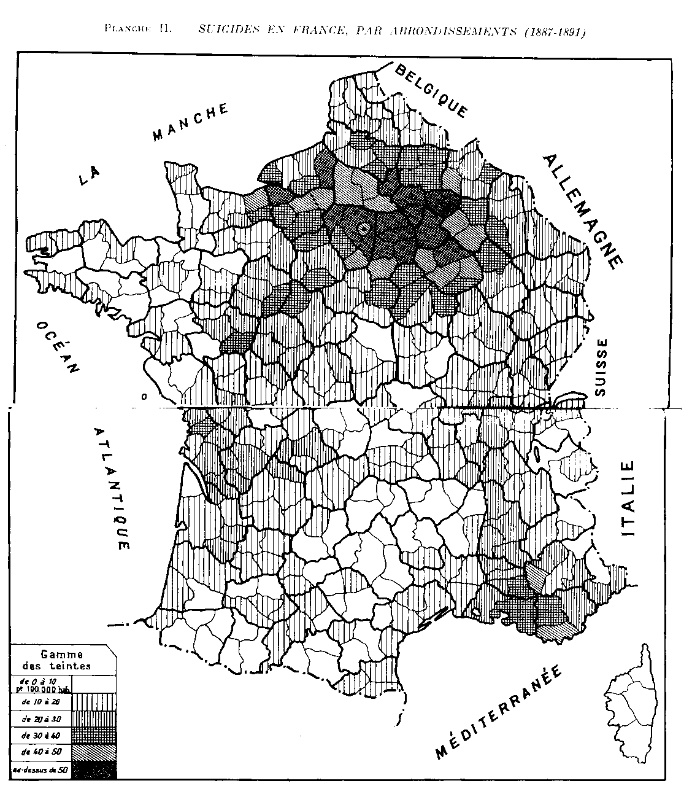

```{r setup}
#| echo: false
#| eval: true


library(knitr)

## Global options
knitr::opts_chunk$set(echo=TRUE,
        	            cache=FALSE,
                      prompt=FALSE,
                      comment=NA,
                      message=FALSE,
                      warning=FALSE,
                      tidy= TRUE)

```


# Introduction {.unnumbered}

Les géographes français qui sont confrontés à l'analyse d'un ensemble de variables décrivant un ensemble de lieux vont le plus souvent procéder à une analyse en deux étapes combinant analyse factorielle et classification ascendante hiérarchique (CAH). Si les variables sont hétérogènes (différentes unités de mesure), ils utiliseront une analyse en composantes principales sur le tableau des variables standardisées suivi d'une CAH en métrique euclidienne. Si les variables forment un tableau de contingence, ils pourront appliquer les méthodes précédentes sur un tableau de profils en ligne (standardisés ou non) ou opter pour le couplage entre analyse factorielle des correspondances et classification ascendante hiérarchique en métrique du $\chi^2$. Ces approches qui s'inscrivent dans la tradition de l'analyse des données « à la française » ont été formalisées initialement par les travaux de @benzecri1973, puis popularisées en géographie par l'ouvrage de @sanders1989 et finalement mises à la disposition d'un large public grâce à l'excellent package `FactoMineR` [@lê2008] et les publications de ses auteurs, notamment @husson2016. Les avantages du couplage entre les deux approches sont évidents puisque les méthodes factorielles permettent d'analyser d'abord les corrélations entre les colonnes du tableau avant de procéder au regroupement des lignes à l'aide de la CAH [@husson2010].

Sans remettre en cause l'intérêt de ces approches, nous souhaiterions proposer ici une autre forme de couplage de méthodes statistiques associant **classification** et **régionalisation**, issue des travaux des écologues qui s'intéressent aux associations spatiales de plantes ou d'animaux et cherchent à en mesurer l'abondance, la spécialisation et la diffusion [@legendre1989; @legendre2013]. Si le point de départ est le même (tableau croisant des lieux décrits par un ensemble de variables), les analyses vont ici surtout porter sur des tableaux homogènes décrivant soit l'abondance de différentes espèces (tableau de contingence), soit leur présence/absence (tableau disjonctif complet). Et surtout elles vont ajouter un élément supplémentaire sous la forme d'une matrice de voisinage décrivant généralement - mais pas toujours - les relations entre lieux sous la forme d'un **graphe de contiguïté** de type planaire.


```{r fig-voisinage}
#| echo: false
#| out.width: "70%"
#| fig-align: 'center'
#| fig-cap: 'Différentes formes de graphe de voisinage (source : [*Spatial Data Science with R and “terra”*](https://rspatial.org/analysis/2-scale_distance.html#distance))'


```

De nombreuses méthodes d'analyse spatiale et d'économétrie tentent de mesurer l'influence exercée ou subie par unité spatiale vis-à-vis des unités proches [@anselin2009;  @anselin2022]. Dans le cas des unités de type aréal, la solution la plus simple est la présence d'une frontière commune (*adjacency*) qui aboutit à un graphe de type planaire. Mais bien d'autres solutions sont possibles comme l'illustre l'exemple du Luxembourg décrit dans le document en ligne *Spatial Data Science with R and `terra`* [@hijmans].


La procédure de régionalisation mise au point récemment avec la fonction `constr.hclust()`du package `adespatial` suit le schéma suivant (@fig-shema) :

```{r fig-shema}
#| echo: false
#| out.width: "100%"
#| fig-align: 'center'
#| fig-cap: 'Algorithme de régionalisation (Guénard & Legendre, 2022)'

knitr::include_graphics("figures/Legendre_regionalisation.jpg")
```

Il s'agit donc d'une méthode de classification ascendante hiérarchique comparable à celles réalisables en langage R-Base avec la fonction `hclust()` ou dans le package `FactoMineR` avec la fonction `HCPC()`,  mais avec deux différences importantes. D'une part, l'ajout de la contrainte de voisinage limite les possibilités de fusion des unités spatiales, ce qui réduit beaucoup le temps de calcul. D'autre part, il est possible d'utiliser un grand nombre de fonctions de dissimilarité en entrée, sans se limiter à celles qui sont privilégiées par les méthodes d'analyse factorielle à la française. Les écologues considèrent en effet que la distance euclidienne (normée ou non) et la distance du $\chi^2$ ne sont pas toujours les plus pertinentes pour mesurer les ressemblances entre lieux, surtout si l'on considère le caractère généralement non gaussien des distributions statistiques des variables associées.


## Un exemple pédagogique en géographie quantitative...  {.unnumbered}

L'objectif du présent article est de discuter l'intérêt de cette procédure pour l'analyse géographique de tableaux de contingence dont les lignes sont des lieux et les colonnes des attributs dont la somme en ligne a un sens. Nous avons retenu comme exemple d'application l'exploration de la distribution spatiale des votes aux élections européennes de 2024 en France métropolitaine (hors Corse). Nous  examinons les résultats des 38 listes de candidats à trois niveaux d'agrégation : les 12 régions, les 94 départements et les 535 circonscriptions législatives (cf. [partie suivante](#données-utilisées)). 

Pour éviter une répétition, chaque niveau d'analyse sera dédié à un aspect différent du problème général de comparaison des approches de régionalisation et de classification et d'analyse de leurs apports à la géographie électorale.

-   **L'échelle régionale** sera utilisée pour rappeler les principes de base des méthodes de classification et de régionalisation en insistant sur le rôle déterminant du choix de la matrice de dissimilarité utilisée en entrée. On se limitera ici à la comparaison des résultats des listes conduites par Jordan Bardella et Marion Maréchal.

-   **L'échelle départementale** constituera le niveau privilégié de comparaison des résultats des méthodes de classification et de régionalisation afin de voir leurs apports respectifs à la compréhension du phénomène. L'analyse porte sur l'ensemble des listes et vise à mettre à jour de grandes régions homogènes sur le plan électoral comme la France de l'Ouest chère à @siegfried1913 et @goguel1953.

-   **L'échelle des circonscriptions** permettra d'examiner l'intérêt d'une approche multiscalaire et de souligner les difficultés de la régionalisation lorsque le niveau d'agrégation dissocie les entités urbaines, périurbaines et rurales. Peut-on produire une régionalisation pertinente face à une distribution spatiale des résultats électoraux en forme de « peau de léopard » ?


L'exemple des données électorales avait été initialement choisi pour des raisons pédagogiques (agrégation à différentes échelles, nombre élevé de listes, intérêt des lecteurs pour un sujet d'actualité...). Il est en effet très classique pour les enseignants de géographie dite « quantitative » d'illustrer les cours d'analyse des données par des tableaux de résultats électoraux par département, région ou arrondissement de Paris, en utilisant successivement une analyse factorielle et une classification ascendante hiérarchique. Dans une publication pédagogique de la revue *Feuilles de géographie* intitulée « *1995 : les élections présidentielles et la fracture sociale où les jubilations des géographes quantitativistes* » [@baron1995], les autrices présentent les apports respectifs de l'analyse factorielle et de la classification et justifient ainsi le choix de l'exemple retenu : 


> « Car depuis A. Siegfried, les *Brouillons Dupont* et *Theo Quant*, quand un géographe quantitativiste rencontre *Le Monde* daté du surlendemain du scrutin, c'est tout de suite le coup de foudre : et que je t'achète, et que je te feuillette frénétiquement, et que je m'extasie devant tel score et que je pleure devant tel autre, et que je saisis le tableau de données et que je sors les analyses... et - oh suprême récompense - que je cartographie les plus beaux résultats. A chaque nouveau scrutin c'est un éternel recommencement ! Alors, vous pensez : quand, par bonheur, les élections présidentielles surviennent avant la session d'examen de juin, c'est l'EU - PHO - RIE ! Imaginez 96 départements et 9 candidats : toutes ces combinaisons ! Vertigineux, non ? »

```{r fig-baron}
#| echo: false
#| out.width: "70%"
#| fig-align: 'center'
#| fig-cap: '1995, les élections présidentielles et la fracture sociale ou les jubilations des géographes quantitativistes (Baron & Emsellem, 1995)'


```


## ... mais faisant débat en géographie électorale et géographie sociale  {.unnumbered} 

Avec le renouveau de la géographie politique en France [@bussi1998; @riviere2009] et le développement de liens plus étroits entre géographes et politistes [@bussi2012; @gombin2014], il n'est toutefois plus possible d'analyser la distribution spatiale des données électorales sans introduire une dimension plus théorique sur la signification des résultats observés. Et, en tous les cas, il peut sembler choquant de transposer une méthode issue de la biologie aux phénomènes humains sans s'être au préalable assuré de la pertinence du transfert. Ce que souligne à juste titre l'un des rapporteurs de la première version de cet article : 

> « L’introduction évoque des techniques "issues des travaux des écologues qui s’intéressent aux associations spatiales de plantes ou d’animaux et cherchent à en mesurer l’abondance, la spécialisation et la diffusion", et le résumé de l’article précise qu’une des techniques de classification/régionalisation présentées dans l’article "s’appuie sur un corpus théorique d’analyse spatiale de la biodiversité des espaces animales ou végétales que l’on peut transposer à de nombreux problèmes géographiques", mais on aimerait en savoir un peu plus sur ce corpus théorique, et sur les "problèmes géographiques" que l’on peut traiter ainsi. En effet et au plan épistémologique, la question de la diffusion telle que traitée en biogéographie et celle des effets de contexte sur la formation des opinions en géographie électorale (pour reprendre le champ thématique de l’article) peuvent difficilement être abordées de la même manière, au risque d’une tendance à la naturalisation des dynamiques sociales. Est-ce à dire, comme le considère le démographe @lebras2002, que les opinions se transmettent de proche en proche à la manière de lois de l’épidémiologie ? Si c’est l’idée que souhaite défendre l’auteur (ce qui est tout à fait possible, il existe une littérature de sociologie anglophone sur les "conversions par la conversation") et dans l’esprit des précautions de Bourdieu & Passeron "la fausse neutralité des techniques" [@bourdieu2005], alors il faut aller plus loin dans l’explicitation des implications théoriques des deux techniques discutées. » (**Jean Rivière, Mai 2025**)

Le choix d'une méthode de classification ou de régionalisation pour étudier la répartition des comportements électoraux n'est donc pas neutre car il conditionne l'interprétation même des résultats en termes de processus de formation des opinions. La classification ne fait en effet pas d'hypothèse *a priori* sur les déterminants contextuels du vote, alors que la régionalisation postule implicitement l'existence d'une autocorrélation spatiale (similarité des unités de proche en proche, liée par exemple à la diffusion d'une innovation) ou d'une auto-corrélation territoriale (similarité des unités liées à leur appartenance à une même maille territoriale et produisant des discontinuités le long des frontières). 

On retrouve en fait ici les termes de la controverse qui opposa G. Tarde et E. Durkheim et que ce dernier discute dans le chapitre 4 du *Suicide* [@durkheim1897].  C'est à l'aide de  la fameuse carte du taux de suicide par arrondissement que Durkheim réfute l'hypothèse diffusionniste dans un texte à bien des égards fondateur pour l'analyse spatiale des phénomènes sociaux [@grasland2010].


> « En définitive, ce que nous montrent toutes les cartes, c'est que le suicide, loin de se disposer plus ou moins concentriquement autour de certains foyers à partir desquels il irait en se dégradant progressivement, se présente, au contraire, par grandes masses à peu près homogènes (mais à peu près seulement) et dépourvues de tout noyau central. Une telle configuration n'a donc rien qui décèle l'influence de l'imitation. » 
>
> « Il n'y a ici ni imitateurs ni imités, mais identité relative dans les effets due à une identité relative dans les causes. Et on s'explique, aisément qu'il en soit ainsi si, comme tout ce qui précède le fait déjà prévu, le suicide dépend essentiellement de certains états du milieu social. Car ce dernier garde généralement la même constitution sur d'assez larges étendues de territoire. Il est donc naturel que, partout où il est le même, il ait les mêmes conséquences sans que la contagion y soit pour rien. C'est pourquoi il arrive le plus souvent que, dans une même région, le taux des suicides se soutienne à peu près au même niveau. »  
>
> « Ce qui prouve que cette explication est fondée, c'est qu'on le voit se modifier brusquement du tout au tout chaque fois que le milieu social change brusquement. Jamais celui-ci n'étend son action au-delà de ses limites naturelles. Jamais un pays que des conditions particulières prédisposent spécialement au suicide n'impose, par le seul prestige de l'exemple, son penchant aux pays voisins, si ces mêmes conditions ou d'autres semblables ne s'y trouvent pas au même degré. »

```{r fig-durkheim}
#| echo: false
#| out.width: "65%"
#| fig-align: 'center'
#| fig-cap: 'Suicides en France par arondissement 1887-1991 (Durkheim E., 1897, *Le Suicide*, Chap. IV)'


```


Émile Durkheim ne disposait évidemment pas de l'apport des modèles multi-niveaux ou des techniques de régression géographiquement pondérée qui permettent de séparer les déterminants individuels et contextuels du suicide. Mais il montre très tôt une sensibilité aux échelles d'agrégation (justification des arrondissements plutôt que des départements qui masqueraient les effets urbains). Il postule très clairement l'existence de « régions » caractérisées par un même « milieu social » jouant le rôle de déterminants dont l'action est bornée par des « limites naturelles » et peut être vu comme un précurseur de @siegfried1913. Tarde, au contraire, annonce les travaux de @hagerstrand1968 sur la diffusion spatiale des innovations et serait un lointain ancêtre des théories du gradient d'urbanité  de @levy2013liens.

Même si ce n'était pas l'objectif initial de cet article, nous aurons donc le souci tout au long de l'analyse des résultats électoraux aux différentes échelles de comparer les résultats des méthodes de classification et de régionalisation en gardant en tête le fait qu'elles reposent sur des hypothèses interprétatives fondamentalement différentes.


## Packages et données  {.unnumbered}


### Les packages utilisés  {.unnumbered}

Les packages nécessaires pour réaliser la chaîne de traitement présentée sont les suivants :

-   `dplyr` pour la manipulation de données
-   `ggplot2` pour la construction de graphique
-   `ggrepel` pour la gestion des *labels* dans les graphiques `ggplot2` 
-   `sf` pour la manipulation de données géographiques vectorielles
-   `mapsf` pour la construction de cartes thématiques 
-   `ineq` pour le calcul de l'indice de Gini
-   `spdep` pour le calcul de matrices spatiales
-   `adespatial` pour réaliser des classifications à contrainte spatiale
-   `cartogramR` pour la construction de cartogrammes (anamorphoses)


```{r packages}
#| echo: true

# Packages utilitaires
library(dplyr)

# Graphiques
library(ggplot2)
library(ggrepel)

# Manipulation des données géographiques
library(sf)

# Cartographie
library(mapsf)
library(cartogramR)

# Statistique 
library(ineq)
library(spdep)
library(adespatial)
```


### Les données utilisées  {.unnumbered}

Pour faciliter la démonstration, les données brutes utilisées (résultats des élections européennes de 2024, fonds de carte et tables de correspondance) ont été simplifiées (cf. [Annexes](#préparation-des-données)). La mise en pratique présentée est réalisée à partir des données suivantes :

#### A. Résultats des élections européennes de 2024 {.unnumbered}

::: panel-tabset
##### Par région

```{r data1}
#| echo: true
don_reg <- readRDS("data/net/don_regi.RDS") 
```

```{r table1}
#| echo: false
#| warning: false
#| eval: !expr knitr::is_html_output()
#| cache: false

# POUR SORTIE HTML
library(DT)
datatable(
    don_reg, 
    rownames = FALSE,  
    extensions = 'Buttons', options = list(
    dom = 'Bfrtip', pageLength = 5))
```

```{r table1_pdf}
#| echo: false
#| warning: false
#| eval: !expr knitr::is_latex_output()
#| cache: false

# POUR SORTIE PDF
kableExtra::kable_styling(knitr::kable(don_reg[1:10,1:8], row.names = F))
```

##### Par département

```{r data2}
#| echo: true
don_dep <- readRDS("data/net/don_dept.RDS") 
```

```{r table2}
#| echo: false
#| warning: false
#| eval: !expr knitr::is_html_output()
#| cache: false

# POUR SORTIE HTML
library(DT)
datatable(
    don_dep, 
    rownames = FALSE,  
    extensions = 'Buttons', options = list(
    dom = 'Bfrtip', pageLength = 5))
```

```{r table2_pdf}
#| echo: false
#| warning: false
#| eval: !expr knitr::is_latex_output()
#| cache: false

# POUR SORTIE PDF
kableExtra::kable_styling(knitr::kable(don_dep[1:10,1:8], row.names = F))
```

##### Par circonscription

```{r data3}
#| echo: true
don_cir <- readRDS("data/net/don_circ.RDS") 
```

```{r table3}
#| echo: false
#| warning: false
#| eval: !expr knitr::is_html_output()
#| cache: false

# POUR SORTIE HTML
library(DT)
datatable(
    don_cir, 
    rownames = FALSE,  
    extensions = 'Buttons', options = list(
    dom = 'Bfrtip', pageLength = 5))
```

```{r table3_pdf}
#| echo: false
#| warning: false
#| eval: !expr knitr::is_latex_output()
#| cache: false

# POUR SORTIE PDF
kableExtra::kable_styling(knitr::kable(don_cir[1:10,1:12], row.names = F))
```

##### Listes de candidats

```{r data4}
#| echo: true
listes <- readRDS("data/net/don_listes.RDS")
```

```{r table4}
#| echo: false
#| warning: false
#| eval: !expr knitr::is_html_output()
#| cache: false

# POUR SORTIE HTML
library(DT)
datatable(
    listes[, c(2:ncol(listes))], 
    rownames = FALSE,  
    extensions = 'Buttons', options = list(
    dom = 'Bfrtip', pageLength = 4))
```

```{r table4_pdf}
#| echo: false
#| warning: false
#| eval: !expr knitr::is_latex_output()
#| cache: false

# POUR SORTIE PDF
kableExtra::kable_styling(knitr::kable(listes[1:10,c(3:7,2)], row.names = F))
```
:::

\

#### B. Fonds de carte des régions, départements et circonscriptions {.unnumbered}

```{r basemap}
map_regi <- readRDS("data/net/map_regi.RDS")
map_dept <- readRDS("data/net/map_dept.RDS")
map_circ <- readRDS("data/net/map_circ.RDS")
```

```{r basemap_map}
#| out.width: "100%"
#| echo: false
#| warning: false
#| eval: true
#| cache: false
#| layout: [[30,30,30]]

library(mapsf)
mf_theme(cex = 2.5, line = 2.5, mar =  c(1, 1, 2.5, 1))

mf_map(map_regi);mf_title("Régions")
mf_map(map_dept);mf_title("Départements")
mf_map(map_circ);mf_title("Circonscriptions")
```

```{r map_reset}
#| echo: false
#| warning: false
#| message: false
mf_theme(x = "default")
```


# Échelle régionale : principes de base

Afin de bien comprendre la différence entre classification et régionalisation et l'importance de la pondération, nous allons commencer par un exemple très simple portant sur la distribution des votes pour les deux principales listes d'extrême droite dans les 12 régions de France métropolitaine.

```{r data1_bis}
#| eval: false
don_reg <- readRDS("data/net/don_regi.RDS") 
```

On calcule le pourcentage de suffrages exprimés pour les listes conduites par Jordan Bardella (liste n° 5, RN) et Marion Maréchal (liste n° 3, Reconquête) à l'échelle des 12 régions de France métropolitaine (hors Corse).

```{r data1_groupe}
#| echo: true

code_reg <- c("IDF", "CVDL", "BOFC", "NORM", "HDFR", "GEST",
              "PDLO", "BRET", "NAQU", "OCCI","AURA", "PACA")

don <- don_reg  |>
        mutate(Bardella = 100 * vot5 / exp, 
               Marechal = 100 * vot3 / exp,
               regi_code = code_reg)  |>
        select(regi, regi_code, regi_nom, Bardella, Marechal) |>
        arrange(regi)

```

On obtient le tableau suivant :

```{r data1_percentage_table}
#| echo: false

kable(don, caption = "Part des suffrages exprimés pour les listes Bardella et Maréchal aux élections européennes de 2024 par région.", digits = 1)

```

## Exploration des variables

### Paramètres principaux

L'examen des paramètres statistiques des deux listes est effectué à l'intérieur des 12 régions étudiées en excluant la Corse et les DROM. Les valeurs sont donc légèrement différentes des résultats obtenus pour la France entière.

```{r parametres}
#| out-width: 100%

# Colonnes ciblées
selcol <- c("Bardella", "Marechal")

# Valeurs minimum
min <- apply(don[, selcol], 2, min)

# Valeurs maximum
max <- apply(don[, selcol], 2, max)

# Moyennes
moy <- apply(don[, selcol], 2, mean)

# Écarts-types
ect <- apply(don[, selcol], 2, sd)

# Variance
var <- ect^2

# Coefficient de variation (%)
cv <- 100 * ect / moy

# Tableau des paramètres calculés
tab <- cbind(min, max, moy, ect, var, cv)
row.names(tab) <- selcol

# Affichage du tableau
print(round(tab,1))

```

::: {.callout-note collapse="true"}
## Commentaire
La liste Bardella obtient une moyenne (non pondérée) de 32.9% dans les 12 régions avec des scores allant de 18.8% en Île-de-France à 42.7% dans les Hauts-de-France. La liste Maréchal affiche quant à elle des scores de 4.2% en Bretagne à 7.7% en PACA avec une moyenne de 5.3%.

La variation absolue des résultats, mesurée par l'écart-type est logiquement beaucoup plus forte pour Bardella ($\sigma=6.5$) que pour Maréchal ($\sigma=0.9$). Mais les variations relatives mesurées par le coefficient de variation (rapport entre l'écart-type et la moyenne) sont assez voisines avec 19.9% pour Bardella et 16.7% pour Maréchal.
:::

### Distribution spatiale

On cartographie la distribution des deux variables en quatre classes à l'aide de la méthode des quantiles (trois régions par classe) et on examine la forme des histogrammes correspondant.


```{r para_map2}
#| echo: false
mf_theme(cex = 1.5, line = 1.5, mar =  c(1, 1, 1.5, 1))

```


```{r Distribution_spatiale}
#| out-width: 100%
#| layout: [[50,50],[50,50]]

# Chargement du fond de carte
map <- readRDS("data/net/map_regi.RDS")

# Jointure fond de carte et tableau de données
mapdon <- left_join(map, don)

# Carte Bardella
mf_map(mapdon,
       type = "choro",
       var = "Bardella",
       nbreaks = 4,
       method = "quantile",
       leg_title = "en %",
       leg_val_rnd = 1, 
       leg_title_cex = 1.5, 
       leg_val_cex = 1.2,
       leg_size = 1.5)

mf_layout("Vote Bardella", frame = TRUE, credits = "", arrow = FALSE)
# ---

# Carte Maréchal
mf_map(mapdon,
       type = "choro",
       var = "Marechal",
       nbreaks = 4,
       method = "quantile",
       leg_title = "en %",
       leg_val_rnd = 1,  
       leg_title_cex = 1.5, 
       leg_val_cex = 1.2,
       leg_size = 1.5)

mf_layout("Vote Maréchal", frame = TRUE, credits = "", arrow = FALSE)
# ---


# Distribution Bardella
mf_distr(don$Bardella, nbins = 4, bw = sd(don$Bardella))
# ---

# Distribution Maréchal
mf_distr(don$Marechal, nbins = 4, bw = sd(don$Marechal))
```

::: {.callout-note collapse="true"}
## Commentaire
La distribution des votes Bardella est légèrement dissymétrique à droite avec une valeur exceptionnellement faible correspondant à l'Île-de-France. La distribution de Maréchal est au contraire dissymétrique à gauche avec une valeur exceptionnellement forte correspondant à la région PACA. La comparaison des deux distributions spatiales ne semble pas révéler à première vue de corrélation positive ou négative, ce qui est confirmé par les coefficients de Pearson ($r=0.20, p =0.53$) ou de Spearman ($\rho =+0.03, p=0.94$).
:::

## Matrices de dissimilarité

En amont d'une classification ou d'une régionalisation, la création d'une matrice de dissimilarité entre les unités spatiales est une étape essentielle qui conditionne la suite des analyses. Deux choix essentiels interviennent alors :

-   le choix d'une transformation ou non des indicateurs
-   le choix d'une métrique

### Espace des variables brutes

La variance des scores de la variable $X_1$ (Liste Bardella) est beaucoup plus forte que celle de la variable $X_2$ (Liste Maréchal), ce qui signifie que, si l'on s'en tient aux variables brutes, les différences entre régions seront liées essentiellement aux variations de la liste $X_1$. Les différentes unités spatiales se positionneront alors dans un espace de la forme suivante :

```{r espace_brut}
#| out-width: 100%

plot(x = don$Bardella,
     y = don$Marechal,
     asp = 1,
     xlab = "Score Bardella en % (X1)",
     ylab = "Score Maréchal en % (X2)",
     main = "Distances dans l'espace des variables brutes",
     pch = 20)

text(x = don$Bardella, 
     y = don$Marechal, 
     labels = don$regi_code,
     pos = 3, 
     cex = 0.8, 
     col = "red")

grid()
```

::: {.callout-note collapse="true"}
## Commentaire
Sur la figure ci-dessus, on a pris soin de construire deux axes orthonormés où une différence d'un point de pourcentage correspond à la même distance horizontalement et verticalement. Il est donc logique que la figure soit beaucoup plus étendue dans le sens horizontal que dans le sens vertical puisque le vote « Bardella » crée plus de différences entre les régions en valeur absolue que le vote « Maréchal ».
:::

On voit sur la figure précédente que les points représentant les unités spatiales sont plus ou moins éloignés, la distance qui les sépare étant une mesure de leur dissimilarité en matière de vote pour les deux listes considérées. Deux mesures de distance peuvent alors classiquement être utilisées pour convertir les positions en matrice de distance :

-   la distance euclidienne : $D^{Euc}(i,j) = \sqrt{\sum_{k=1}^K (X_{ik}-X_{jk})^2}$
-   la distance de Manhattan : $D^{Man}(i,j) = \sum_{k=1}^K |X_{ik}-X_{jk}|$

Les deux solutions donnant des résultats assez voisins, on se limitera ici à l'analyse de la matrice des distances euclidiennes.

```{r mat_dist_eucli}
DS_eucl <- as.matrix(dist(don[, c("Bardella", "Marechal")], 
                          method = "euclidean", 
                          upper = TRUE, 
                          diag = FALSE))

colnames(DS_eucl) <- don$regi_code
rownames(DS_eucl) <- don$regi_code
```

Matrice des distances euclidiennes :

```{r mat_dist_eucli_table}
#| echo: false
#| out-width: 100%

library(gt)
data.frame(DS_eucl)  |> gt(rownames_to_stub = T) |>
  tab_header(title = md("**Dissimilarité en distance euclidienne brute**")) |>
  fmt_number(decimals = 1)
```


::: {.callout-note collapse="true"}
## Commentaire
La plus forte dissimilarité est observée entre la région Île-de-France (IDF) et la région Hauts-de-France (HDFR) et la plus faible entre les régions Centre-Val de Loire (CVDL) et Normandie (NORM).

En comparant la matrice de dissimilarité au graphique orthonormé précédent, on comprend que les différences entre unités spatiales sont essentiellement produites par les variations du vote « Bardella » qui possède une plus forte variance que le vote « Maréchal ». Ce dernier n'introduit que des différenciations secondaires.
:::

### Espace des variables standardisées

Si le choix de la métrique euclidienne ou de la métrique de Manhattan introduit peu de différences dans les matrices de dissimilarité, il en va tout autrement de la standardisation des variables qui consiste à ramener chaque indicateur à une même moyenne ($\mu = 0$) et surtout un même écart-type ($\sigma = 1$).

$$X^*_i = \frac{X_i - \mu_X}{\sigma_X}$$

Pour bien apprécier la différence, on peut commencer par visualiser les distances (donc les dissimilarités) dans l'espace des variables standardisées en adoptant comme précédemment un repère orthonormé mais dont l'unité de mesure est l'écart-type et non plus les points de pourcentage :

```{r standardisation}
#| out-width: 100%

# Standardisation des deux variables
don$Bardella_std <- as.double(scale(don$Bardella))
don$Marechal_std <- as.double(scale(don$Marechal))

# Représentation graphique
plot(x = don$Bardella_std,
     y = don$Marechal_std, 
     asp = 1,
     xlim = c(-2.5, 2.5),
     ylim = c(-1.5, 3),
     xlab = "Score Bardella standardisé (X1)",
     ylab = "Score Maréchal standardisé (X2)",
     main = "Distances dans l'espace des variables standardisées",
     pch = 20)

text(x = don$Bardella_std, 
     y = don$Marechal_std, 
     labels = don$regi_code, 
     pos = 2, 
     cex = 0.8, 
     col = "red")

grid()
```

Les distances euclidiennes dans ce nouvel espace des variables standardisées sont évidemment différentes de celles que l'on avait obtenues dans l'espace des variables brutes.

```{r mat_dist_eucli_std}
DS_eucl_std <- as.matrix(dist(don[, c("Bardella_std", "Marechal_std")],
                         method = "euclidean", 
                         upper = TRUE, 
                         diag = FALSE))

colnames(DS_eucl_std) <- don$regi_code
rownames(DS_eucl_std) <- don$regi_code

```

Matrice des distances euclidiennes standardisées :

```{r mat_dist_eucli_std_table}
#| echo: false
#| out-width: 100%

data.frame(DS_eucl_std) |> gt(rownames_to_stub = T) |>
  tab_header(title = md("**Dissimilarité en distance euclidienne standardisée**")) |>
  fmt_number(decimals = 1)
```

::: {.callout-note collapse="true"}
## Commentaire
Par rapport à la représentation dans l'espace non standardisé, il y a désormais un étirement comparable du nuage de points dans les deux directions de l'espace standardisé. Ce résultat est logique puisque les écarts-types sont désormais égaux pour les deux candidats ce qui signifie que les différences liées au vote « Maréchal » vont jouer le même rôle que celles liées au vote « Bardella ». Les deux unités spatiales les plus différentes ne sont plus l'Île-de-France (IDF) et les Hauts-de-France (HDFR) mais la Bretagne (BRET) et la région Provence-Alpes-Côte d'Azur (PACA), ce que l'on peut facilement vérifier en calculant la distance euclidienne sur variables standardisées.
:::

### Espace des variables ordinales

On pourrait transformer nos deux variables $X_1$ et $X_2$ en rang pour en faire des distributions uniformes insensibles au jeu des valeurs exceptionnelles. Si l'on effectue une transformation en rang, la géométrie de l'espace devient celle d'une grille de 12x12 positions en fonction des rangs obtenus par les unités spatiales pour le vote « Bardella » ou le vote « Maréchal ». Dans cet espace discret (sauf en cas de valeurs *ex æquo*) il semble logique d'utiliser la somme des différences de rang en valeur absolue, c'est-à-dire la distance de Manhattan sur les variables transformées. Cette distance correspond au plus court chemin en suivant la grille qui croise les rangs de $X_1$ et $X_2$ :

```{r calcul_rank}
#| out-width: 100%

# Calcul des rangs
don$Bardella_rnk <- rank(-don$Bardella)
don$Marechal_rnk <- rank(-don$Marechal)

# Représentation graphique
plot(x = don$Bardella_rnk,
     y = don$Marechal_rnk,
     asp = 1,
     xlab = "Rang pour le score Bardella (X1)",     
     ylab = "Rang pour le score Maréchal (X2)",
     frame = TRUE,
     axes = FALSE,
     xlim = c(1, 12),
     ylim = c(1, 12),
     main = "Distances dans l'espace des rangs",
     pch = 20)

text(x = don$Bardella_rnk, 
     y = don$Marechal_rnk,
     labels = don$regi_code, 
     pos = 2, 
     cex = 0.8, 
     col = "red")

axis(1, at = seq(1, 12, 1), tck = 1, lty = 2, col = "gray")
axis(2, at = seq(1, 12, 1), tck = 1, lty = 2, col = "gray")
```

Calcul de la matrice de distance sur les rangs :

```{r  mat_dist_man_rank}
DS_Man_rnk <- as.matrix(dist(don[, c("Bardella_rnk", "Marechal_rnk")],
                        method = "manhattan",
                        upper = TRUE,
                        diag = FALSE))

colnames(DS_Man_rnk) <- don$regi_code
rownames(DS_Man_rnk) <- don$regi_code
```

```{r mat_dist_man_rank_table}
#| echo: false
#| out-width: 100%

data.frame(DS_Man_rnk) |> gt(rownames_to_stub = T) |>
  tab_header(title = md("**Dissimilarité de Manhattan sur les rangs**")) |>
  fmt_number(decimals = 0)
```

::: {.callout-note collapse="true"}
## Commentaire
On trouve désormais une distance maximale de 20 qui place à égalité la paire IDF-HDFR (plus forte distance euclidienne brute) et la paire BRET-PACA (plus forte distance euclidienne standardisée). Cette troisième solution offre donc ici une sorte de compromis entre les deux précédentes, même si elle est en réalité plus proche de la méthode standardisée que de la méthode brute.
:::

Il existe de nombreuses autres solutions permettant de transformer le tableau de données en d'autres matrices de dissimilarité tout aussi légitimes que les trois présentées ci-dessus. On pourrait par exemple utiliser une autre métrique telle que distance de Tchebychev qui est la magnitude absolue maximale des différences entre les coordonnées des points.

Le point important à retenir avant de passer à la suite des analyses est que **le choix de la matrice de dissimilarité exerce une influence cruciale sur les résultats des méthodes de classification ou de régionalisation qui vont être mises en œuvre**. Or, ce choix est trop souvent implicite dans les logiciels de statistiques qui proposent par défaut des méthodes fondées sur la **variance** c'est-à-dire sur le **carré des distances euclidiennes standardisées**. Ce choix est le plus souvent justifié car il évite aux débutants en statistique des erreurs fatales telles que le fait de ne pas standardiser un jeu de variables hétérogènes ayant des unités de mesure et des ordres de grandeur différents. Mais il peut aussi aboutir à des résultats discutables ou du moins pas forcément les plus adaptés à la problématique.

## Classification

### Choix du critère à optimiser

Les méthodes de classification et de régionalisation ascendante hiérarchiques ont pour point commun d'opérer un regroupement des unités spatiales en allant des plus ressemblantes au moins ressemblantes. Elles fournissent un arbre de regroupement qui permet de visualiser chaque étape du regroupement et des critères permettant d'opérer un compromis entre l'homogénéité interne des classes (ou régions) et leur nombre.

Une bonne classification (ou une bonne régionalisation) devra comporter à la fois le moins de classes (ou régions) possibles pour offrir un bon résumé, mais également un nombre suffisant pour éviter de constituer des ensembles trop hétérogènes. On utilise souvent la part de variance expliquée par la partition pour mesurer cette qualité. Cependant ce choix conduit à imposer une métrique (distance euclidienne) et un algorithme (critère de *Ward*). Il est plus intéressant de prendre un critère plus général fondé sur le rapport entre les dissimilarités internes et externes des entités constituées. Si on s'en tient à la définition de classes ou régions homogènes comme des **groupes d'unités spatiales qui se ressemblent plus entre elles qu'elles ne ressemblent aux unités spatiales des autres groupes**, alors notre critère à optimiser $H$ prendra une des formes suivantes :

$$H = \frac{Dissimilarité \space inter \space groupe}{Dissimilarité \space intra \space groupe}$$

ou

$$H = \frac{Dissimilarité \space inter \space groupe}{Dissimilarité \space totale}$$

ou

$$H =  1- \frac{Dissimilarité \space intra \space groupe}{Dissimilarité \space totale}$$

### Choix de l'algorithme de regroupement

Une classification ascendante hiérarchique peut s'opérer selon différents algorithmes qui correspondent à différents critères d'optimisation. Le critère qui semble intuitivement le plus simple est la minimisation des **distances moyennes** intra-classes et la maximisation des **distances moyennes** inter-classes. Cette méthode du *average linkage* est la plus simple à comprendre, mais il existe beaucoup d'autres algorithmes cherchant par exemple à minimiser les distances minimales (*single linkage*), les distances maximales (*complete linkage*), les distances médianes, etc. La méthode par défaut de la plupart des logiciels de statistiques est appelée méthode de *Ward*. Elle consiste à minimiser la somme des distances entre les centres de gravité des classes, ce qui la place dans le cadre de l'analyse de la variance [@ward1963]. Cette méthode comporte toutefois des variantes qui produisent des résultats différents comme cela a été démontré par @murtagh2014. On distingue en pratique deux méthodes *Ward.D* et *Ward.D2* qui s'appliquent à des distances simples ou des distances élevées au carré.

Pour assurer une bonne comparabilité des résultats de classification et de régionalisation, nous utiliserons ici la fonction R-base `hclust()` (*hierarchical clustering*) plutôt que la fonction `HCPC()` du package `FactoMineR` qui est plus puissante mais introduit souvent des modifications de l'algorithme de base à l'insu de l'utilisateur non averti (notamment le fait d'optimiser *a posteriori* les classes par une méthode de type *k-means*). La régionalisation sera faite à l'aide de la fonction `constr.clust()` du package `adespatial` qui reproduit fidèlement la méthode de la fonction `hclust()` en y ajoutant simplement une contrainte de contiguïté des unités regroupées. Pour plus de détail on se reportera à la description de la classification avec contrainte de contiguïté dans @guénard2022.

### Comparaison des classifications

Nous allons examiner les résultats des classifications opérées sur les matrices de dissimilarité en distance euclidienne sur variables standardisées ou non standardisées et en distance de Manhattan sur variables ordinales avec la même méthode *Ward.D*. Nous examinerons également dans chaque cas la distribution géographique des résultats pour une partition en trois classes afin de voir si les distributions spatiales obtenues correspondent ou non à des régionalisations de la France.

```{r classification}
# CAH - Euclidienne non standardisée
cah_euc <- hclust(dist(DS_eucl), method = "ward.D")

# CAH - Euclidienne standardisée
cah_euc_std <- hclust(dist(DS_eucl_std), method = "ward.D")

# CAH - Manhattan ordinale
cah_man_rnk <- hclust(dist(DS_Man_rnk), method = "ward.D")

# Découpage en 3 classes
clas_euc <- as.factor(cutree(cah_euc, k = 3))
clas_euc_std <- as.factor(cutree(cah_euc_std, k = 3))
clas_man_rnk <- as.factor(cutree(cah_man_rnk, k = 3))

# Ajout des classifications dans la couche géographique
map$clas_euc  <- clas_euc 
map$clas_euc_std <- clas_euc_std
map$clas_man_rnk <- clas_man_rnk
  
```

Représentation graphique des classifications :


```{r classification_representation}
#| out.width: 100%
#| layout: "[[55,45],[55,45],[55,45]]"

## 1.a Arbre CAH - Euclidienne non standardisée
plot(cah_euc,
     hang = -1,
     cex.main = 1.2,
     main = "1.a Distance euclidienne non standardisée",
     ylab = "Dissimilarité",
     sub = NA,
     xlab = "")
# ---

# 1.b Carte CAH - Euclidienne non standardisée 
mf_map(map, type = "typo", var = "clas_euc")
mf_layout("1.b CAH en 3 classes", arrow = FALSE, credits = "")
# ---


## 2.a Arbre CAH - Euclidienne standardisée
plot(cah_euc_std,
     hang = -1,
     cex.main = 1.2,
     main = "2.a Distance euclidienne standardisée",
     ylab = "Dissimilarité",
     sub = NA,
     xlab = "")
# ---

# 2.b Carte CAH - Euclidienne non standardisée 
mf_map(map, type = "typo", var = "clas_euc_std")
mf_layout("2.b CAH en 3 classes",  arrow = FALSE, credits = "")
# ---


## 3.a Arbre CAH - Ordinale de Manhattan
plot(cah_man_rnk,
     hang = -1,
     cex.main = 1.2,
     main = "3.a Distance ordinale de Manhattan",
     ylab = "Dissimilarité",
     sub = NA,
     xlab = "")
# ---

# 3.b Carte CAH - Ordinale de Manhattan 
mf_map(map, type = "typo", var = "clas_man_rnk")
mf_layout("3.b CAH en 3 classes", arrow = FALSE, credits = "")
```


::: {.callout-note}
## Commentaire
Les trois classifications aboutissent logiquement à des regroupements différents puisqu'elles sont fondées sur des matrices de dissimilarité différentes. La région Île-de-France ne se regroupe jamais avec les régions voisines car son score pour la liste Bardella est beaucoup plus faible et son score pour la liste Maréchal un peu plus élevé. Elle se regroupe fréquemment avec les régions de l'Ouest (Bretagne, Pays-de Loire, Aquitaine) qui se caractérisent par la faiblesse relative du vote d'extrême droite. La région PACA se regroupe quant à elle surtout avec sa voisine d'Occitanie avec laquelle elle partage de forts votes « Bardella » et Maréchal, mais elle diffère trop de la région Auvergne-Rhône-Alpes pour former un regroupement avec les régions du Nord et de l'Est. Au total, **aucune des classifications n'aboutit à une régionalisation** c'est-à-dire à une division de la France en trois sous-ensembles connexes de régions voisines.
:::

## Régionalisation

La fonction `constr.hclust()` du package `adespatial` permet de réaliser une **classification ascendante hiérarchique sous contrainte de contiguïté** en suivant un algorithme strictement comparable à celui d'une classification. La seule différence réside dans le fait d'éliminer des solutions en interdisant le regroupement d'unités spatiales si elles ne sont pas voisines ou plus précisément connexes. 


### Graphe de contiguïté

Pour bien comprendre la différence entre classification et régionalisation, il est intéressant de visualiser sur une carte les matrices de contiguïté associées à chacune des deux méthodes.

-   La **classification** fait appel implicitement à un *graphe complet* qui est non planaire et dans lequel toutes les fusions d'unités spatiales en classes sont autorisées, qu'elles soient voisines ou non, connexes ou non.

-   La **régionalisation** fait de son côté appel à un *graphe de voisinage* qui est le plus souvent fondé sur la contiguïté administrative et de type planaire. On l'obtient - dans l'exemple présenté ici - en détectant les régions qui ont une frontière commune. Il est facile de générer ce graphe en utilisant par exemple la fonction `st_intersects()` du package `sf`.

```{r graphes}
#| out.width: 100%
#| layout: [[50,50]]

##### GRAPHE COMPLET #####
# Construction d'un tableau de lien (i, j) complet
reg_link_full <- expand.grid(i = mapdon$regi_code, 
                             j = mapdon$regi_code, 
                             stringsAsFactors = FALSE)

# Création de la couche géographique des liens
reg_links <- mf_get_links(x = mapdon, 
                          df = reg_link_full, 
                          x_id = "regi_code", 
                          df_id = c("i","j"))


##### GRAPHE DE VOISINAGE (contiguïté) ##### 
# Calcul de la matrice de contiguïté
mat_conti <- st_intersects(mapdon, mapdon, sparse = FALSE)
colnames(mat_conti) <- mapdon$regi_code
rownames(mat_conti) <- mapdon$regi_code

# Suppression de la moitié de la matrice (et de la diagonale)
mat_conti[lower.tri(mat_conti, diag = TRUE)] <- FALSE

# Construction d'un tableau de lien (i, j) de contiguïté
reg_link_contig <- as.data.frame.table(mat_conti, responseName = "contig") |> 
                             filter(contig == TRUE)

# Création de la couche géographique de liens
reg_links_contig  <- mf_get_links(x = mapdon, 
                                  df = reg_link_contig, 
                                  x_id = "regi_code", 
                                  df_id = c("Var1","Var2"))


##### CARTOGRAPHIE ##### 
# Graphe complet
mf_map(mapdon)
mf_map(reg_links, col = "red3", add = TRUE)
mf_label(mapdon, var = "regi_code", cex = 1.3, col = "blue3", halo = TRUE, bg = "white")
mf_layout("Graphe complet", credits = "")
# ---
     
# Graphe de voisinage
mf_map(mapdon)
mf_map(reg_links_contig , col = "red3", add = TRUE)
mf_label(mapdon, var = "regi_code", cex = 1.3, col = "blue3", halo = TRUE, bg = "white")
mf_layout("Graphe de voisinage", credits = "")
```

::: {.callout-note}
## Commentaire
Dans les analyses de classification précédentes, aucune contrainte de contiguïté spatiale n'était introduite et l'on pouvait par exemple fusionner dans une même classe la Bretagne et l'Île-de-France qui ont des profils similaires en matière de vote pour les listes d'extrême droite. Dans une analyse de régionalisation, il n'est plus possible de réunir ces deux unités spatiales sauf si on ajoute d'autres régions les reliant telles que la Normandie ou les Pays de Loire et le Centre-Val de Loire. On peut donc dire qu'**une régionalisation est une classification avec contrainte de voisinage spatial** ou, inversement, qu'**une classification est une régionalisation sans contrainte de voisinage spatial**.
:::

Il découle de ce qui précède une conséquence fondamentale qui est le fait qu'**une régionalisation suppose un double choix en ce qui concerne la matrice de dissimilarité, d'une part, et la matrice de voisinage, d'autre part**. Or, si le choix de la contiguïté administrative paraît évident dans le cas étudié ici, d'autres solutions seraient possibles pour établir un graphe de voisinage aboutissant à d'autres formes de régionalisation. On peut en donner rapidement deux exemples.

-   Une **triangulation de Delaunay** pourrait être établie entre les centres des unités spatiales, qui aboutirait également à un graphe planaire mais ne respecterait pas forcément le critère de présence d'une frontière commune. On peut la réaliser facilement avec la fonction `tri2nb()` du package `spdep`.
-   La **méthode des** ***k*** **plus proches voisins** pourrait également servir à déterminer pour chaque unité spatiale les *k* plus proches en prenant comme critère la distance à vol d'oiseau entre leurs centres. On réalise facilement le graphe à l'aide des fonctions `knearneigh()` et `knn()` du package `spdep`. On obtient alors un graphe non planaire où chaque unité spatiale aurait des nombres de voisins plus proches que dans le cas du graphe de contiguïté (mais pas forcément égal).

```{r triangulation de Delaunay}
#| layout: [[50,50]]

##### GRAPHE DE VOISINAGE (triangulation de Delaunay) #####
# Matrice de contiguïté 
x <- tri2nb(coords = st_coordinates(st_centroid(mapdon)))
mat_contig_delaunay <- nb2mat(x)
colnames(mat_contig_delaunay) <- mapdon$regi_code
rownames(mat_contig_delaunay) <- mapdon$regi_code

# Construction d'un tableau de lien (i, j) de contiguïté 
reg_contig_delaunay <- as.data.frame.table(mat_contig_delaunay, 
                                           responseName = "contig_voronoi") |> 
                                    filter(contig_voronoi > 0)

# Création de la couche géographique de liens
reg_links_contig_delaunay  <- mf_get_links(x = mapdon, 
                                           df = reg_contig_delaunay, 
                                           x_id = "regi_code", 
                                           df_id = c("Var1","Var2"))


##### GRAPHE DE VOISINAGE (méthode des k plus proches voisins) #####
# Matrice de contiguïté
x <- knearneigh(x = st_coordinates(st_centroid(mapdon)), k = 3)
x <- knn2nb(x)
mat_contig_kvoisins <- nb2mat(x)
colnames(mat_contig_kvoisins) <- mapdon$regi_code
rownames(mat_contig_kvoisins) <- mapdon$regi_code

# Construction d'un tableau de lien (i, j) de contiguïté 
mat_contig_kvoisins <- as.data.frame.table(mat_contig_kvoisins, 
                                           responseName = "k_voisins") |> 
                                  filter(k_voisins > 0)

# Création de la couche géographique de liens
reg_links_contig_kvoisins  <- mf_get_links(x = mapdon, 
                                           df = mat_contig_kvoisins, 
                                           x_id = "regi_code", 
                                           df_id = c("Var1","Var2"))


##### CARTOGRAPHIE #####
# Triangulation de Delaunay
mf_map(mapdon, col="lightyellow")
mf_map(reg_links_contig_delaunay , col = "red3", add = TRUE)
mf_label(mapdon, var = "regi_code", cex = 1.3, col = "blue3", halo = TRUE, bg = "white")
mf_layout("Triangulation de Delaunay", credits = "")
# ---

# k plus proches voisins
mf_map(mapdon, col="lightyellow")
mf_map(reg_links_contig_kvoisins , col = "red3", add = TRUE)
mf_label(mapdon, var = "regi_code", cex = 1.3, col = "blue3", halo = TRUE, bg = "white")
mf_layout("Plus proches voisins (k=3)", credits = "")
```

::: {.callout-note}
## Commentaire
Comme on peut le voir sur les cartes ci-dessus, il est possible de produire des régionalisations avec contrainte de voisinage qui ne s'appuient pas obligatoirement sur le critère de contiguïté et de présence d'une frontière commune. Dans le cas de la triangulation de Delaunay, il devient possible de regrouper par exemple la région PACA avec la région BOFC sans être obligé d'y inclure la région AURA. Inversement, dans le cas de la méthode des trois plus proches voisins, il n'est plus possible de fusionner directement les régions AURA et NAQU bien qu'elles possèdent une frontière commune. Les résultats seront toujours des régionalisations dans la mesure où il existera bien une contrainte de voisinage. Mais ils feront apparaître des groupes d'unités spatiales qui semblent disjointes sur une carte mais ne le sont pas dans le graphe de voisinage choisi.
:::

### Régionalisation

Comme dans le cas de la classification, il existe de nombreux algorithmes pour regrouper les unités spatiales voisines en cherchant à minimiser les dissimilarités intra-régionales. L'un des plus complet est celui du logiciel *Geoda* [@anselin2009] qui dispose d'une [documentation très pédagogique](https://geodacenter.github.io/documentation) sur chacun des algorithmes de régionalisation. Malheureusement le package `rgeoda` (correspondant à l'application principale disponible sous Windows) n'est pas régulièrement mis à jour et était indisponible au moment de la rédaction de cet article. 

Nous nous limiterons donc ici à l'algorithme de régionalisation réalisé par la fonction `constr.hclust()` du package `adespatial` qui présente l'intérêt d'utiliser exactement les mêmes formules de calcul que la fonction R-base `hclust()` et offre une parfaite possibilité de comparaison des résultats entre les deux approches. Pour éviter de multiplier les exemples, nous nous limiterons ici à l'analyse des régionalisations fondées sur une matrice de contiguïté, en reprenant les trois matrices de dissimilarité précédentes.

```{r regionalisation_contig}
# CAH contrainte - Euclidienne non standardisée
reg_euc <- constr.hclust(d = dist(DS_eucl), 
                         method = "ward.D", 
                         links = reg_link_contig)

# CAH - Euclidienne standardisée
reg_euc_std <- constr.hclust(d = dist(DS_eucl_std), 
                             method = "ward.D", 
                             links =reg_link_contig)

# CAH - Manhattan ordinale
reg_man_rnk <- constr.hclust(d = dist(DS_Man_rnk), 
                             method = "ward.D", 
                             links =reg_link_contig)

# Découpage en 3 classes
clas_euc <- as.factor(cutree(reg_man_rnk, k=3))
clas_euc_std <- as.factor(cutree(reg_euc_std, k=3))
clas_man_rnk <- as.factor(cutree(reg_man_rnk, k=3))

# Ajout des classifications dans la couche géographique
map$clas_euc  <- clas_euc 
map$clas_euc_std <- clas_euc_std
map$clas_man_rnk <- clas_man_rnk
```

Représentations graphiques des classifications :

```{r regionalisation_contig_representation}
#| out.width: 100%
#| layout: "[[55,45],[55,45],[55,45]]"

## 1.a Arbre CAH - Euclidienne non standardisée
plot(reg_euc,
     hang = -1,
     cex.main = 1.2,
     main = "1.a Distance euclidienne non standardisée",
     ylab = "Dissimilarité",
     sub = NA,
     xlab = "")
# ---

# 1.b Carte CAH - Euclidienne non standardisée 
mf_map(map, type = "typo", var = "clas_euc")
mf_layout("1.b CAH-REG en 3 classes", frame = TRUE, arrow = FALSE, credits = "")
# ---


## 2.a Arbre CAH - Euclidienne standardisée
plot(reg_euc_std,
     hang = -1,
     cex.main = 1.2,
     main = "2.a Distance euclidienne standardisée",
     ylab = "Dissimilarité",
     sub = NA,
     xlab = "")
# ---

# 2.b Carte CAH - Euclidienne standardisée 
mf_map(map, type = "typo", var = "clas_euc_std")
mf_layout("2.b CAH-REG en 3 classes", arrow = FALSE, credits = "")
# ---


## 3.a Arbre CAH - Ordinale de Manhattan
plot(reg_man_rnk,
     hang = -1,
     cex.main = 1.2,
     main = "3.a Distance ordinale de Manhattan",
     ylab = "Dissimilarité",
     sub = NA,
     xlab = "")
# ---

# 3.b Carte CAH - Ordinale de Manhattan 
mf_map(map, type = "typo", var = "clas_man_rnk")
mf_layout("3.b CAH-REG en 3 classes", arrow = FALSE, credits = "")
```

::: {.callout-note}
## Commentaire
Comme dans le cas de la classification (cf. [partie 1.3.3](#comparaison-des-classifications)), on observe tout d'abord une forte variation des résultats selon le choix de la matrice de dissimilarité. On retrouve également une tendance à l'isolement des régions IDF et PACA qui forment à nouveau un singleton puisqu'elles sont fortement différentes des autres unités spatiales et de leurs voisines en particulier. L'apport spécifique de la régionalisation consiste surtout ici à mettre en valeur le voisinage des trois régions atlantiques (BRET, PDLO et NAQU) qui se regroupent du fait de leur voisinage spatial et de leur similarité politique. Une comparaison avec les arbres de classification précédents montre logiquement des regroupements plus tardifs du fait de l'impossibilité de rassembler certaines régions non voisines. **Une régionalisation aboutit nécessairement à des regroupements moins homogènes qu'une classification du fait des contraintes spatiales qui lui sont imposées.**
:::

## Conclusion

Au final, cet exercice souligne la complexité des options possibles du fait du nombre de choix qu'il faut opérer pour réaliser une classification et *a fortiori* une régionalisation. Encore n'avons-nous pas fait état de l'ensemble des solutions alternatives, notamment celles qui se fondent sur des méthodes de classification descendantes que l'on trouve dans l'excellent package R [`rainette`](https://juba.github.io/rainette/articles/introduction_usage.html) [@rainette] ou sur des méthodes de type noyaux mobiles disponibles dans le R-base avec la fonction `kmeans()`.

La question la plus fondamentale est probablement la suivante : **quel est l'apport d'une régionalisation par rapport à une classification pour l'analyse d'un phénomène social** ? Puisque nous avons vu qu'une régionalisation est par définition moins efficace qu'une classification pour constituer des groupes homogènes, il faut que la prise en compte des contraintes spatiales apporte un avantage décisif à la régionalisation pour choisir de la mettre en œuvre. Ce qui suppose que la matrice de voisinage ait un sens pour la personne qui va interpréter les résultats.

C'est ce point que nous allons maintenant explorer en étudiant l'ensemble des résultats des élections européennes à trois niveaux d'agrégation.

# Échelle départementale : classification et régionalisation hiérarchiques

La réalisation d'une classification et d'une régionalisation des résultats des élections européennes va être menée à différentes échelles, depuis le niveau des régions jusqu'à celui des circonscriptions en passant par le niveau départemental. L'objectif sera de construire des classes ou des régions présentant des profils électoraux homogènes en matière de vote.

Préalablement à ces analyses, il est important d'analyser la distribution des votes afin de distinguer l'implantation spatiale des listes candidates à ce scrutin européen afin de repérer celles qui vont le plus contribuer aux différenciations au niveau national ou au niveau local.

## Analyse des listes

Les électeurs français ont eu le choix entre 38 listes lors des élections européennes de juin 2024 (cf. [données](#a.-résultats-des-élections-européennes-de-2024)). Mais seule une partie a connu une audience nationale et beaucoup de petites listes n'ont même pas été capables de fournir des bulletins dans tous les bureaux de votes.

### Loi rang-taille ?

La distribution du pourcentage de votes en fonction du rang des listes suit une loi exponentielle presque parfaite ($r^2 =0.98 , p < 0.001$).

```{r rang_taille}
#| fig.align: center
#| out-width: 90%
#| output: asis

# Métadonnées sur les listes électorales
listes <- readRDS("data/net/don_listes.RDS")

# Résultats des votes par circonscription
don_cir <- readRDS("data/net/don_circ.RDS") 
result_vote <- don_cir[, 12:49]

# Calcul % national de vote
listes$pct <- 100 * apply(result_vote, 2, sum) / sum(result_vote)

# Calcul de l'indice de Gini
listes$gini <- apply(result_vote, 2, ineq::Gini)

# Calcul du rang du pourcentage de vote
listes$rang <- rank(-listes$pct)

# Régression linéaire
mod <- lm(log(listes$pct) ~ listes$rang)

# Graphique rang-taille
ggplot(listes, aes(x = rang, y = pct, label = tete_nom)) +
    geom_point() +
    geom_line() +
    geom_text_repel(cex = 3) +
    scale_x_continuous("Rang") +
    scale_y_log10("Part des suffraxes exprimés (%)") +
    geom_smooth(method = "lm") +
    theme_minimal() +
    ggtitle("Relation entre le % de voix et le rang des listes")
```

Résumé statistique de la régression linéaire :

```{r rang_taille_stat}
#| fig.align: center
#| output: asis
#| echo: false

library(stargazer)
stargazer(mod,
          type = "html",
          dep.var.labels = "% de votes reçus par une liste (log)",
          dep.var.caption = "Variable dépendante",
          covariate.labels = "Rang de la liste")


```

### Typologie

La régularité de la loi précédente ne permet pas d'établir une rupture nette permettant de séparer grandes et petites listes. Mais une typologie combinant le logarithme du score national en % et l'indice de concentration de Gini par circonscription permet de mieux distinguer des listes mineures ayant obtenu des votes dans un petit nombre de circonscriptions et des listes d'audience nationale ayant obtenu des voix dans un nombre plus important de circonscriptions même lorsque leur score est faible.

```{r rang_taille_typo}
#| out.width: 100%

# Passage en logarithme du % national et de l’indice de Gini
tab_log <- cbind(log(listes$pct), listes$gini)

# Classification par la méthode des k-means
w <- kmeans(tab_log, centers = 2, iter.max = 1000)

# Récupération de la classification 
listes$type <- as.factor(w$cluster)
levels(listes$type) <- c("Listes nationales", "Listes mineures")

# Représentation graphique de la classification
ggplot(listes, aes(x = pct, y = gini, label = tete_nom, colour = type)) +
  geom_point() +
  geom_text_repel(cex = 3) +
  stat_ellipse() +
  scale_x_log10("Score national (en %)") +
  scale_y_continuous("Indice de concentration de Gini") +
  theme_light() +
  ggtitle("Typologie des listes candidates aux élections européennes de juin 2024")
```

::: {.callout-note}
## Commentaire
Il existe une corrélation négative entre le score national d'une liste et sa concentration mesurée par l'indice de Gini. Les listes les plus importantes sont en général celles qui sont le mieux réparties tandis que les petites listes ont en général concentré les suffrages dans quelques circonscriptions. Cette règle connaît toutefois des exceptions. Ainsi la liste *Alliance rurale* conduite par Jean Lassalle, bien implantée dans le Sud-Ouest, a obtenu un score national assez élevé (2,4%) tout en affichant un indice de concentration assez fort (0,41). Inversement, la liste du parti NPA *Pour un Monde sans frontières ni patrons ...* conduite par Selma Labib n'a recueilli que très peu de voix (0,16%) mais beaucoup mieux réparties dans un nombre important de circonscriptions avec un indice de concentration faible (0,16) comparable à celui des listes les plus importantes.
:::

## Classification

### Choix de la matrice de dissimilarité

On choisit comme matrice de dissimilarité le coefficient de divergence c'est-à-dire la part des électeurs qui devrait changer de votes pour que les deux unités spatiales affichent le même profil électoral. Cet indice correspond à la moitié de la distance de Manhattan entre les profils en pourcentage :

$$\frac{1}{2} \sum_{p=1}^{38} {|\frac{X_{ip}}{X_{i.}} - \frac{X_{jp}}{X_{j.}}|}$$

On peut illustrer le calcul en prenant l'exemple de la plus forte dissimilarité qui est observée entre le département de l'Aisne (02) et le département de Paris (75) :

```{r difference}
#| message: false

# Chargement des résultats par département 
don_dept <- readRDS("data/net/don_dept.RDS")

# Chargement d'un fond de carte
map_dept <- readRDS("data/net/map_dept.RDS")

# Calcul de la répartition % de vote par département pour chaque liste
result_vote_dep <- don_dept[, 11:ncol(don_dept)]
mat_vote_dep <- 100 * result_vote_dep / apply(result_vote_dep, 1, sum) 
rownames(mat_vote_dep) <- don_dept$dept
colnames(mat_vote_dep) <- listes$tete_nom

# Calcul des différences de % entre le l'Aisne et Paris
tab_diff <- data.frame(t(mat_vote_dep[c("02", "75"), ]))
names(tab_diff) <- c("Aisne (02)", "Paris (75)")
tab_diff$dif <- tab_diff[, 1] - tab_diff[, 2]
# Différence absolue
tab_diff$difabs <- abs(tab_diff$dif)

# Calcul des totaux
tab_diff <- rbind(tab_diff, apply(tab_diff, 2, sum))
row.names(tab_diff)[nrow(tab_diff)] <- "Total"

# Affichage de la table
kable(tab_diff, digits = 1 )
```

```{r mat_dissimilarité}
#| message: false
#| warning: false

# Calcul de la matrice de dissimilarité
dissim <- dist.ldc(mat_vote_dep, method = "manhattan", silent = TRUE) / 2
```

::: {.callout-note collapse="true"}
## Commentaire
La somme des différences de vote est égale à 94,5 points de pourcentage. En divisant par deux on obtient une valeur de 47,2 qui est le pourcentage de vote qu'il faudrait modifier dans l'un ou l'autre département pour aboutir à des profils similaires. Le coefficient de divergence est compris entre 0 (votes identiques) et 100 (aucun vote commun).
:::

### Résultats de la classification

L'application d'une méthode de classification ascendante hiérarchique à la matrice de dissimilarité fait apparaître assez nettement cinq classes qui regroupent souvent des départements voisins mais sans pour autant former des régions.

```{r CAH_dissimilarite}
#| out.width: 100%
#| layout: [[55,45]]

# Classification
cah_dissim <- hclust(dissim, method = "ward.D")

# Découpage en 5 classes
clas_dissim <- as.factor(cutree(cah_dissim, 5))

# Ajout des résultats de la classification
map_dept$cah_dissim <- as.factor(clas_dissim)

## A. Arbre CAH - Dissimilarité 
plot(cah_dissim, hang = -1, cex = 0.5, main = "Arbre de classification")
# ---

# B. Carte CAH - Dissimilarité 
mf_map(map_dept, type = "typo", var = "cah_dissim")

mf_layout(title = "CAH - Dissimilarité - 5 classes - par département",
          credits = "Mehode de Ward appliquée à la distance de divergence",
          arrow = FALSE)
```

Une analyse des profils permet ensuite de caractériser ces classes.

```{r ana_profil}

# Calcul du % national de vote
tabres <- data.frame(mat_vote_dep) 

tot <- tabres |>  
        summarise_all(.funs = c("mean"))

# Récupération de la classe d'appartenance
tabres$clas_dissim <- clas_dissim

# Moyenne du % vote pour chaque classe
res <- tabres |> 
        group_by(clas_dissim) |> 
        summarise_all(.funs = c("mean"))

# Calcul des écarts des classes au profil moyen
mat <- res[, -1]

# Boucle
for (i in 1:5) {
mat[i, ] <- mat[i, ] - as.matrix(tot)
}

mat <- as.data.frame(t(mat))
colnames(mat) <- c("Classe1", "Classe2", "Classe3", "Classe4", "Classe5")

# Ajout totaux
mat$Profil <- as.numeric(tot)

```

Écart des classes au profil moyen (listes principales) :

```{r ana_profil_table}
#| echo: false
mat <- mat[order(-mat$Profil), ]
kable(mat[1:13, ], digits = 2)
```

::: {.callout-note collapse="true"}
## Interprétation des profils
-   La **classe 1** est assez proche du **profil moyen** avec une légère surreprésentation des votes Bardella (+1,5) et Aubry (+0,79), associée à une sous-représentation des votes Glucksman (-0,91), Lassalle (-0,79), Hayer (-0,55) et Bellamy (-0,32).
-   La **classe 2** est caractérisée par la **très forte surreprésentation du vote d'extrême droite** pour Bardella (+7,5), Maréchal (+0.38) ou Philippot (+0,05) ainsi que le parti animaliste (+0,2) associée à une sous-représentation des autres partis, en particulier de Glucksmann (-2,78) et Toussaint.
-   La **classe 3** surreprésente les votes des **partis centristes**, qu'il s'agisse du centre gauche (Hayer : +2,56), du centre droit (Glucksman : +2,01) ou des écologistes (Toussaint : +1,15) et elle sous-représente les partis d'extrême droite mais aussi d'extrême gauche.
-   La **classe 4** s'inscrit plutôt dans **une spécificité régionale du Sud-Ouest** caractérisée par l'importance du vote Lassalle (+3,66) et du vote Deffontaines (+0,75), associée au vote de centre gauche de la liste Glucksmann (+2,46). Comme dans le cas précédent, on observe une faiblesse du vote pour les partis d'extrême droite ou d'extrême gauche.
-   La **classe 5** correspond enfin à un **vote des grandes métropoles** caractérisé par un score exceptionnel de la liste Aubry (+8,59), associé à une surreprésentation des votes pour les autres partis de gouvernement de droite (Bellamy : +1,06, Hayer : +1,23) ou de gauche (Glucksmann : +2,85, Toussaint : +2,44)
:::

## Régionalisation

### Matrice de contiguïté

On calcule la matrice de contiguïté au niveau départemental à l'aide du package `sf`. Puis, on la visualise sur une carte.

```{r}
#| echo: false
#| eval: true

mf_theme(x = "default")
```

```{r mat_contig}
#| out-width: 100%
#| fig-align: center
# Jointure FDC & données
mapdon_dept <- left_join(map_dept, don_dept)

##### GRAPHE DE VOISINAGE (contiguïté) ##### 
# Calcul de la matrice de contiguïté
mat_conti <- st_intersects(mapdon_dept, mapdon_dept, sparse = FALSE)
colnames(mat_conti) <- mapdon_dept$dept
rownames(mat_conti) <- mapdon_dept$dept

# Suppression de la moitié de la matrice (et diagonale)
mat_conti[lower.tri(mat_conti, diag = TRUE)] <- FALSE

# Construction d'un tableau de lien (i, j) de contiguïté
reg_link_contig <- as.data.frame.table(mat_conti, responseName = "contig") |> 
                             filter(contig == TRUE)

# Création de la couche géographique de liens
reg_links_contig  <- mf_get_links(x = mapdon_dept, 
                                  df = reg_link_contig, 
                                  x_id = "dept", 
                                  df_id = c("Var1","Var2"))
     
##### CARTOGRAPHIE
mf_map(mapdon_dept)
mf_map(reg_links_contig , col = "red3", add = TRUE)
mf_label(mapdon_dept, var = "dept", col = "blue3", halo = TRUE, bg = "white")
mf_layout("Graphe de voisinage", frame = TRUE, credits = "")
```

### Dissimilarités locales

Avant de procéder à la régionalisation, on peut visualiser les discontinuités en extrayant les frontières des unités spatiales à l'aide de la fonction `mf_get_borders()`du package `mapsf` et en effectuant une jointure avec les valeurs de dissimilarité [@grasland1997]. On pourra ainsi repérer les limites qui séparent des départements très ressemblants (donc susceptibles de se regrouper en régions) ou au contraire très différents (qui seront probablement localisés dans des régions différentes).

```{r local_dissimilarite}
#| out-width: 100%
#| fig-align: center

# Conversion de la matrice de dissimilarité en tableau long
m <- as.matrix(dissim)
tab_dis <- cbind(expand.grid(dimnames(m)), value = as.vector(m))
names(tab_dis ) <- c("i", "j", "DSij")

# Extraction des frontières d'unités spatiales
map_border_dep <- mf_get_borders(mapdon_dept)[, c("dept", "dept.1")]
names(map_border_dep) <- c("i", "j", "geometry")

# Jointure
map_border_dep <- merge(map_border_dep, tab_dis, by = c("i", "j"))

# Cartographie des dissimilarités
mf_map(mapdon_dept, type = "base", col = "lightyellow")
mf_map(map_border_dep,
       type = "prop",
       col = "red",
       var = "DSij",
       val_max = 70,
       leg_pos = "left")
mf_layout(title = "Cartographie des discontinuités", credits = "")
```

::: {.callout-note}
## Commentaire
Les discontinuités les plus remarquables sont celles qui séparent les départements d'Île-de-France du reste du Bassin parisien (ex. dissimilarité de 26 points entre Yvelines et Eure) mais aussi les départements franciliens entre eux (ex. dissimilarité de 33 points entre Seine-Saint-Denis et Paris). On retrouve également de très fortes différences entre les départements qui abritent les grandes métropoles de province (Lyon, Toulouse, Nantes, Lille...) et leurs voisins. Mais apparaissent également des discontinuités entre certains départements plus ruraux. A l'inverse, on repère des groupes de départements peu différents les uns des autres dans les Alpes, le sud du Bassin parisien ou le Centre-Ouest. La carte des discontinuités permet donc d'anticiper les regroupements les plus probables qui vont intervenir au cours de l'étape de régionalisation.
:::

Une approche différente, proposée par les écologues, consiste à mesurer la contribution des unités spatiales et des variables les décrivant à la production des dissimilarités au niveau global et local. Cette approche est classiquement menée à l'aide de mesures basées sur la **variance,** mais les auteurs proposent de la généraliser à **une mesure quelconque de dissimilarité** ce qui permet une meilleure adéquation à la problématique [@legendre2013]. Et qui permet d'appliquer la méthode non pas à l'ensemble des dissimilarités (comme dans une ACP ou une CAH) mais uniquement aux dissimilarités locales.

### Résultats de la régionalisation

La réalisation d'une régionalisation ascendante hiérarchique est très simple avec la fonction `constr.hclust()`du package `adespatial`. 

```{r result_regio}
#| out.width: 100%
#| layout: [[50,50]]

# Régionalisation ascendante hiérarchique
regio <- constr.hclust(d = dissim, method = "ward.D", links = reg_link_contig)

# Arbre de classification
plot(regio,
     main = "Arbre de classification",
     hang = -1)
# ---

# Hiérarchie des nœuds
barplot(rev(regio$height)[1:20],
        main = "Hiérarchie des nœuds",
        names.arg = 1:20,
        cex.names = 0.4)
```

::: {.callout-note}
## Choix d'une partition
L'arbre de classification et l'indice de hiérarchie des nœuds mettent tout d'abord en valeur les partitions en 2, 3 ou 4 classes qui se détachent très clairement des regroupements ultérieurs. On observe toutefois que la régionalisation en deux classes est moins efficace que la partition en trois classes ce qui peut surprendre un utilisateur habitué à utiliser des méthodes fondées sur la distance euclidienne au carré et la variance. Ce résultat est en fait logique dans la mesure où nous avons utilisé une métrique non euclidienne [@guénard2022] et surtout une contrainte de contiguïté [@randriamihamison2021]. Dans notre exemple, il signale que le premier niveau de découpage de la France en régions électorales n'est pas une opposition Nord-Est/Sud-Ouest mais un découpage en trois entités qui isole la région Île-de-France. Quant au découpage en quatre régions, il met en valeur à l'intérieur de la France du nord-est le cas de la partie nord et est du Bassin parisien qui est singulièrement différente du reste de la France du Nord-Est. Au-delà de cette partition en quatre classes, on observe une suite de partitions de niveaux voisins jusqu'au 9e nœud de l'arbre où apparaît une discontinuité nette, ce qui incite à retenir une partition en 10 régions. Le niveau de dissimilarité de ce découpage en 10 régions sera approximativement le même que celui que nous avions utilisé précédemment pour réaliser une classification comportant cinq classes. Ce qui confirme qu'une régionalisation est par définition moins efficace qu'une classification puisqu'elle doit comporter deux fois plus de groupes pour aboutir au même niveau d'homogénéité, du moins dans le cas du jeu de données utilisé ici.
:::

On peut représenter les quatre niveaux de régionalisation en effectuant un découpage de l'arbre à l'aide de la fonction `cutree()` et d'un package quelconque de cartographie thématique dans R comme `mapsf` ou `tmap`.

```{r}
#| echo: false
#| eval: true

mf_theme(cex = 1.5)
```


```{r, cartograhie}
#| out.width: 100%
#| layout: "[[50,50],[50,50],[50,50]]"

# Découpage de l'arbre en différents nombres de classes
mapdon_dept$reg2 <- as.factor(cutree(regio, 2))
mapdon_dept$reg3 <- as.factor(cutree(regio, 3))
mapdon_dept$reg4 <- as.factor(cutree(regio, 4))
mapdon_dept$reg10 <- as.factor(cutree(regio, 10))


# En 2 classes
mf_map(mapdon_dept, var="reg2",type="typo", leg_title = "Classes")
mf_layout("2 régions", credits = "", arrow=FALSE)
#---

# En 3 classes
mf_map(mapdon_dept, var="reg3",type="typo", leg_title = "Classes")
mf_layout("3 régions", credits = "", arrow=FALSE)
#---

# En 4 classes
mf_map(mapdon_dept, var="reg4",type="typo", leg_title = "Classes")
mf_layout("4 régions", credits = "", arrow=FALSE)
#---

# En 10 classes
mf_map(mapdon_dept, var="reg10",type="typo", leg_title = "Classes")
mf_layout("10 régions", credits = "", arrow=FALSE)
```

On peut également utiliser la fonction `constr.hclust()` du package `adespatial` à condition de lui fournir les centroïdes des unités spatiales. On peut ainsi visualiser la façon dont le graphe de contiguïté a été segmenté pour aboutir à une régionalisation. Il est alors intéressant d'y superposer la carte des discontinuités pour mieux visualiser comment les régions respectent - dans la mesure du possible - les frontières correspondant aux plus fortes différences entre unités voisines.

```{r}
#| echo: false
#| eval: true

mf_theme(x = "default")
```


```{r regio_discon}
#| out-width: 100%
#| fig-align: center
 
# Extraction des coordonnées des centroïdes de département
dep_centroide <- st_coordinates(st_centroid(mapdon_dept))

# Régionalisation
regio <- constr.hclust(d = dissim,
                       method = "ward.D",
                       links = reg_link_contig,
                       coords = dep_centroide)


# Carte de la régionalisation (graphe) et des discontinuités
mf_map(mapdon_dept, type="base", col="white",border="black",lwd=0.2)
mf_map(map_border_dep,
       type = "prop",
       col = "gray50",
       var = "DSij",
       lwd_max = 5,
       leg_pos = "left",
       add = TRUE)
mf_layout("Relation entre régionalisation et discontinuités", credits = "")
plot(regio, k = 10, links = TRUE, axes = FALSE, plot = FALSE, hybrids = "no")
```

On procède maintenant à l'analyse des écarts au profil moyen en reprenant la même procédure que pour la classification. Pour faciliter l'analyse, on recode les noms des régions pour combiner les partitions en trois régions (Nord-Est = NE, Sud-Ouest = SO, Île-de-France = IF) et la partition en 10 (les quatre sous-régions du Nord-Est sont codées NE1, NE2, NE3, NE4, les trois régions du Sud-Ouest SO1, SO2, SO3 et les trois régions d'Île-de-France IF1, IF2, IF3)

```{r ecart_profil_moy}

# Suppression de la colonne de la classification précédente
tabres <- subset(tabres, select =-c(clas_dissim))

# Création d'une classification en 10 classes
tabres$clas_10 <- cutree(regio, 10)

# Calcul des moyennes des classes
res <- tabres |> group_by(clas_10) |> summarise_all(.funs = c("mean"))
mat <- res[, -1]

# Calcul des écarts des classes au profil moyen
for (i in 1:10) {
  mat[i, ] <- mat[i, ] - as.matrix(tot)
  }

# Transposition de la matrice en dataframe
mat <- as.data.frame(t(mat))

# Renommage des colonnes
colnames(mat) <- c("NE1","NE2","NE3","NE4",
                   "SO1","SO2","SO3",
                   "IDF1","IDF2","IDF3")

# Ajout totaux
mat$Profil <- as.numeric(tot)

```

Écart des régions au profil moyen (listes principales) :

```{r ana_profil_reg_table}
#| echo: false
mat <- mat[order(-mat$Profil), ]
kable(mat[1:13, ], digits = 2)
```


::: {.callout-note collapse="true"}
## Interprétation des profils 

**La région Nord-Est (NE)** se caractérise par une surreprésentation générale des votes pour les listes de droite (Bellamy) ou d'extrême droite (Bardella, Maréchal) dans trois de ses composantes sous-régionales, auxquelles il faut ajouter une enclave.

-   La **sous-région NE1 de type droite et extrême droite** occupe les franges sud du Bassin parisien ainsi que l'Alsace et le nord de la Lorraine. Elle se caractérise par une légère surreprésentation du vote « Bardella » (+2,57) combinée à une surreprésentation des autres votes de droite (Bellamy +0,48; Hayer +0,29; Maréchal +0,11; Philippot +0,07) et une sous-représentation des listes de gauche (Glucksman -1,49; Aubry -1,12; Toussaint -0,62).
-   la **sous-région NE2 de type bastion RN rural et ouvrier** occupe le nord et l'est du Bassin parisien de la Normandie à la Lorraine en passant par le Nord et la Champagne. Sa caractéristique principale est un score exceptionnellement élevé pour la liste Bardella (+9,65) et une faiblesse relative de toutes les autres listes à l'exception de la liste Thouy du parti animaliste.
-   la **sous-région NE3 de type bastion d'extrême droite diversifié** correspond à un vote d'extrême droite mélangeant davantage le vote RN de la liste Bardella (+4,04) avec d'autres avatars de l'extrême droite se traduisant par une surreprésentation des listes Maréchal (+1,12), Asselineau (+0,13) ou Philippot (+0,12). Comme dans le cas précédent, les autres listes de droite classique ou de gauche sont sous-représentées à l'exception de la liste Aubry (+0,2).
-   la **sous-région NE4 de type métropolitain écologiste** constitue une enclave à l'intérieur de la région NE regroupant la métropole lyonnaise et le nord des Alpes. Elle affiche des caractéristiques très différentes voire opposées aux types précédents. Elle se caractérise par un score très élevé des écologistes (Toussaint +2,32; Gobernatori +0,23), ainsi que des partis de gauche (Aubry +1,11) de centre gauche (Glucksman +1,15) et de centre droit (Hayer +0,67). Le vote « Bardella » y est nettement sous-représenté (-4,51) mais pas le vote de droite (Bellamy +0,33) ou d'extrême droite dans d'autres versions (Maréchal +0,37; Asselineau +0,09).

**La région Sud-Ouest (SO)** affiche un profil général très différent caractérisé par la faiblesse conjointe des votes d'extrême droite (Bardella, Maréchal) et d'extrême gauche et une surreprésentation des listes portées par les partis centristes de gouvernement (Hayer, Glucksman). Mais elle affiche trois variantes bien typées en raison du rôle de deux listes à forte composante régionale. 

- La **sous-région SO1 de type identité régionale sud-ouest** regroupe les départements situés au nord des Pyrénées, du Pays basque à Toulouse. Son originalité fondamentale réside dans le poids exceptionnel du vote pour la liste *Alliance Rurale* portée par Jean Lassalle (+3,69) combinée à un vote très élevé pour les listes socialiste (Glucksman +3,62) et communiste (Deffontaines +0,42). 
- La **sous-région SO2 de type radical socialiste** prolonge la région précédente vers le Massif central, exception faite de la vallée de la Garonne acquise à l'extrême droite. Elle conserve des caractéristiques voisines de la classe S01 mais moins accentuées. Elle aurait probablement fusionné avec la précédente sans l'obstacle constitué par les départements conquis par l'extrême droite qui font obstacle à l'unification en une seule région. 
- La **sous-région SO3 de type ouest chrétien démocrate** associe les départements de Bretagne, Pays de Loire, Basse-Normandie et nord de l'Aquitaine. Elle affiche une forte résistance au vote d'extrême droite (Bardella -5,42; Maréchal -0,70) comme d'extrême gauche (Aubry -1,54; Deffontaines -0,36) et concentre ses suffrages sur les listes des partis de centre gauche (Glucksmann +2,81), de centre droit (Hayer +3,59) ainsi que les écologistes (Toussaint +1,45, Governatori +0,18).

La **région Île-de-France (IF)** forme la troisième région, caractérisée par une résistance générale au vote d'extrême droite et une performance exceptionnellement élevée de la liste LFI portée par Aubry. Elle n'en comporte pas moins de très forts contrastes internes.

- La **sous-région IF1 de type métropolitain central** regroupe Paris, les Hauts-de-Seine, les Yvelines et le Val-de-Marne dans une catégorie caractérisée par le partage des votes entre listes des partis de gouvernement de centre gauche (Glucksman +3,81) et de centre droit (Hayer +3,38) ainsi que par des scores très élevés pour la liste LFI (Aubry +8,3), les écologistes (Toussaint +2,8) et la droite classique (Bellamy +3,4) ou les formes d'extrême droite élitiste (Maréchal +0,70). 
- La **sous-région IF2 de type métropolitain périphérique** regroupe les départements de grande couronne du Val-d'Oise, de l'Essonne et de Seine-et-Marne avec un rejet du RN beaucoup moins marqué (-5,4) et un vote toujours plus important pour la liste LFI de M. Aubry (+9,55). Les partis centristes ont désormais des scores légèrement plus faibles que leur moyenne nationale. 
- La **sous-région IF3 de type bastion LFI** se limite à l'unique département de Seine-Saint-Denis dont la caractéristique est le score exceptionnel de la liste Aubry (+28,8) et à un degré bien moindre des écologistes (Toussaint +1,75) et communistes (Deffontaines +0,29)
:::

## Discussion

Quels sont les apports respectifs des deux approches de régionalisation et de classification à cette échelle d'agrégation départementale ?

### Intérêt et limites de la classification

L'analyse de classification offre obligatoirement un meilleur résumé de l'information contenue dans la matrice de dissimilarité dans la mesure où elle ne subit pas la contrainte de contiguïté qui est imposée à la régionalisation. Même si la méthode de classification ascendante hiérarchique n'aboutit pas nécessairement à une solution optimale en matière de maximisation de l'homogénéité intra-classe et de l'hétérogénéité inter-classe (la méthode des *k-means* est *a priori* plus efficace et moins coûteuse en temps de calcul), elle présente l'avantage de fournir des résumés à différents niveaux d'agrégation et de distinguer des types et des sous-types.

La limite de la méthode concerne sa visualisation cartographique qui laisse apparaître des blocs régionaux qui correspondent rarement à une classe unique. Les résultats n'ont pas vocation à produire une géographie du vote même si le commentaire des résultats fait appel à des notions de voisinage et de localisation.

### Intérêt et limites de la régionalisation

L'analyse de la régionalisation possède les mêmes propriétés de regroupement hiérarchique en régions qui se subdivisent ensuite en sous-régions ce qui permet une analyse nuancée des oppositions principales et secondaires. L'analyse géographique des résultats permet donc bien de construire un commentaire multiscalaire partant des divisions principales (Nord-Est / Nord-Ouest / Île-de-France) pour extraire ensuite des subdivisions secondaires ce qui est la procédure habituelle de la description d'un espace géographique.

La limite de l'analyse tient ici au poids de la contrainte de contiguïté qui oblige à regrouper les entités à l'intérieur d'un ensemble d'unités voisines même lorsqu'elles sont séparées par des discontinuités extrêmement élevées. Ce qui aboutit à une hétérogénéité parfois très élevée des entités regroupées.


# Échelle des circonscriptions : gradients urbains ou discontinuités ?

La reproduction des analyses précédentes au niveaux des 535 circonscriptions législatives constitue de prime abord un avantage puisque ces unités spatiales ont des populations beaucoup plus proches entre elles que les départements. La loi impose en effet des seuils minimum et maximum de population à ces unités afin d'assurer une représentation équitable des citoyens à l'Assemblée nationale. Malgré les exceptions (départements peu peuplés ayant au moins un député) et les manipulations de limites pour favoriser tel ou tel parti (*gerrymandering*), les circonscriptions sont un cadre idéal d'observation des résultats des élections européennes... surtout lorsqu'elles sont suivies d'une dissolution de l'Assemblée nationale comme ce fut le cas en 2024.

Ce changement d'échelle entraîne toutefois un saut de complexité dans l'analyse puisque les oppositions entre les espaces ruraux, périurbains et métropolitains qui étaient encore peu visibles à l'échelle des départements sont désormais fondamentales et créent pour beaucoup de partis politiques des distributions en « peau de léopard » composées de taches isolées (e.g. liste LFI présente surtout en ville) ou de nappes percées de trous (e.g. vote RN majoritaire ou largement en tête dans les zones rurales et fortement réduit dans les métropoles). La question est alors de savoir si la transition entre espaces métropolitains et ruraux s'opère de façon graduelle (hypothèse du gradient d'urbanité) ce qui autoriserait la création de régions de proche en proche. Ou si on passe brutalement d'un comportement à un autre ce qui ferait des métropoles des enclaves bien délimitées cernées par des discontinuités.

Une carte publiée dans *Cybergeo* [@CybergeoConversation2022] à propos du premier tour des élections présidentielle de 2022 à l'échelle des intercommunalités montre clairement l'existence d'une double structure à la fois régionale et métropolitaine :

```{r fig-O_finance}
#| echo: false
#| out.width: "100%"
#| fig-align: 'center'
#| fig-cap: 'De l’autocorrélation spatiale du vote à la présidentielle. [https://doi.org/10.58079/NFYZ](https://doi.org/10.58079/NFYZ). O. Finance, 2022.'

knitr::include_graphics("figures/carte-election-presidentielle-2022.png")
```

::: {.callout-note}
L'auteur précise que la carte combine en fait des variables de niveau (structures des votes en 2022) et des variables d'évolution (entre les élections de 2017 et 2022) :

> Cette carte a été construite à l’aide d’une classification ascendante hiérarchique. Elle synthétise 9 variables décrivant la structure du vote en 2022 (abstention, vote blanc, vote pour chaque famille politique) et 9 variables similaires décrivant l’évolution du vote entre 2017 et 2022. Ces variables sont toutes standardisées et décrivent donc pour les 9 premières des écarts par rapport au vote de l’ensemble des intercommunalités, pour les 9 suivantes des variations positives ou négatives par rapport à l’évolution constatée au niveau de l’ensemble des intercommunalités. (Source : Finance O., 2022, [Cybergeo Conversation](https://cybergeo.hypotheses.org/1199))

La structure obtenue combine à la fois un archipel métropolitain (classe représentée en rouge) et des blocs régionaux bien identifiables indiquant une forte autocorrélation spatiale des votes dans les espaces non métropolitains.
:::

## Matrice de dissimilarité

On charge les fichiers de circonscriptions et on construit la matrice de dissimilarité en utilisant la même procédure que pour les départements (cf. [partie 2.2](#choix-de-la-matrice-de-dissimilarité)).

```{r data_circo}

# Résultats par circonscription et fond de carte
don_circ <- readRDS("data/net/don_circ.RDS")
map_circ <- readRDS("data/net/map_circ.RDS")

# Calcul de la répartition % de vote par circonscription pour chaque liste
result_vote_circ <- don_circ[, 12:ncol(don_circ)]
mat_vote_circ <- 100 * result_vote_circ / apply(result_vote_circ, 1, sum) 
rownames(mat_vote_circ) <- don_circ$circ
colnames(mat_vote_circ) <- listes$tete_nom

# Dissimilarité
dissim <- dist.ldc(mat_vote_circ, method = "manhattan", silent = TRUE) / 2
```

On prépare ensuite la la matrice de contiguïté des circonscriptions en suivant là encore la procédure utilisée pour les départements  (cf. [partie 2.3](#matrice-de-contiguïté)).

```{r carte_contig_circo}
#| out-width: 100%
#| fig-align: center

# Jointure fond de carte et résultats de vote
mapdon_circ <- left_join(map_circ, don_circ)

# Matrice de contiguïté
mat_conti <- st_intersects(mapdon_circ, mapdon_circ, sparse = FALSE)
colnames(mat_conti) <- mapdon_circ$circ
rownames(mat_conti) <- mapdon_circ$circ

# Suppression de la moitié de la matrice (et diagonale)
mat_conti[lower.tri(mat_conti, diag = TRUE)] <- FALSE

# Construction d'un tableau de lien (i, j) de contiguïté
circ_link_contig <- as.data.frame.table(mat_conti, responseName = "contig") |> 
                             filter(contig == TRUE)

# Création de la couche géographique de liens
circ_links_contig  <- mf_get_links(x = mapdon_circ, 
                                   df = circ_link_contig, 
                                   x_id = "circ", 
                                   df_id = c("Var1","Var2"))
     
# Cartographie
mf_map(mapdon_circ,col="lightyellow")
mf_map(circ_links_contig , col = "red3", add = TRUE)
mf_layout("Matrice de contiguïté des circonscriptions", credits = "")
```

Pour mieux visualiser les zones urbaines, on peut créer une carte par anamorphose à l'aide de la fonction `cartogramR()` du package du même nom. On prend comme variable de poids le nombre de votants ce qui donne des surfaces approximativement égales aux unités spatiales.

```{r cartogram}
#| out-width: 100%
#| fig-align: center
#| message: false
#| warning: false

# Construction du cartogramme en fonction du nombre de votants
cartogram_R <- cartogramR(mapdon_circ,
                          count = "vot",
                          method = "dcn",
                          options=list(verbose=8))$cartogram |>
                st_as_sf()
                
# Jointure cartogramme et résultats de vote
cartogram_circ <- left_join(cartogram_R, don_circ)

# Matrice de contiguïté du cartogramme
mat_conti <- st_intersects(cartogram_circ, cartogram_circ, sparse = FALSE)
colnames(mat_conti) <- cartogram_circ$circ
rownames(mat_conti) <- cartogram_circ$circ

# Suppression de la moitié de la matrice (et de la diagonale)
mat_conti[lower.tri(mat_conti, diag = TRUE)] <- FALSE

# Construction d'un tableau de lien (i, j) de contiguïté
circ_link_contig <- as.data.frame.table(mat_conti, responseName = "contig") |> 
                             filter(contig == TRUE)

# Création de la couche géographique de liens
circ_links_contig  <- mf_get_links(x = cartogram_circ, 
                                  df = circ_link_contig, 
                                  x_id = "circ", 
                                  df_id = c("Var1","Var2"))

mf_map(cartogram_R, col = "lightyellow")
mf_map(circ_links_contig , col = "red3", add = TRUE)
mf_layout("Anamorphose sur le nombre de votants et matrice de contiguïté des circonscriptions",
           credits = "")

```

## Classification

La classification fait nettement ressortir une division en 4 classes, sans rupture manifeste au-delà de ce seuil.

```{r classification_circ}
#| out.width: 100%
#| layout: [[50,50]]

# Classification
cah <- hclust(dissim, method = "ward.D")

##### Représentation graphique #####
## A. Arbre CAH - Dissimilarité 
plot(cah, hang = -1, main = "Arbre de classification")
# ---

# B. Carte CAH - Dissimilarité 
barplot(rev(cah$height)[1:15],
        names.arg = 1:15,
        cex.names = 0.6)
```

La cartographie de ces classes met en évidence une coupure évidente entre les espaces métropolitains et les espaces périphériques, chacun se subdivisant ensuite en deux sous-types.

```{r}
#| echo: false
#|eval: true
mf_theme(cex = 1.5)
```

```{r classification_circ_map}
#| out.width: 100%
#| layout: [[50,50]]


# Découpage en 4 classes
clas <- as.factor(cutree(cah, 4))
levels(clas) <- c("Metrop. 1", "Metrop. 2", "Periph. 1", "Periph. 2")

mapdon_circ$cah <- clas
cartogram_R$cah <- clas

# Création d’une palette de couleur
mypal <- c("red", "orange", "lightgreen", "darkgreen")

# Carte - découpage réel des circonscriptions
mf_map(mapdon_circ,
       type = "typo",
       var = "cah",
       leg_title = "Classes",
       lwd = 0.5,
       leg_pos = "left",
       pal = mypal)

mf_layout(title = "Classification des circonscriptions",
          credits = "Mehode de Ward appliquée à la distance de divergence",
          arrow = FALSE)
# ---


# Carte - cartogramme en fonction du nombre de votants
mf_map(cartogram_R,
       type = "typo",
       var = "cah",
       leg_title = "Classes",
       lwd = 0.5,
       leg_pos = "left",
       pal = mypal)

mf_layout(title = "Classification des circonscriptions (anamorphose)",
          credits = "Mehode de Ward appliquée à la distance de divergence",
          arrow = FALSE)
```

Le profil des quatre classes est assez simple à interpréter puisqu'il s'ordonne presque parfaitement en fonction du score de la liste du RN de Bardella.

```{r ecart_profil_moy_circo}

# Calcul du % national de vote
tabres <- data.frame(mat_vote_circ) 
tot <- tabres |>  summarise_all(.funs = c("mean"))

# Récupération de la classe d'appartenance
tabres$clas <- clas

# Moyenne du % vote pour chaque classe
res <- tabres |> 
        group_by(clas) |> 
        summarise_all(.funs = c("mean"))

# Calcul des écarts des classes au profil moyen
mat <- res[, -1]

for (i in 1:5) {
  mat[i, ] <- mat[i, ] - as.matrix(tot)
}

mat <- as.data.frame(t(mat))

### Élimination d'une colonne vide
mat<-mat[,-5]
colnames(mat) <- c("Metrop.1", "Metrop.2", "Periph.1", "Periph.2")

# Ajout totaux
mat$Profil <- as.numeric(tot)
```

Écart des régions au profil moyen (listes principales) :

```{r ana_profil_circ_table}
#| echo: false
mat <- mat[order(-mat$Profil), ]
kable(mat[1:13, ], digits = 2)
```

::: {.callout-note collapse="true"}
## Interprétation des profils
-   **Les espaces métropolitains centraux (Metrop. 1)** votent beaucoup moins pour le Rassemblement National (Bardella) et les partis à implantation régionale (Lassalle, Deffontaines), privilégiant les partis traditionnels de gouvernement (Hayer, Glucksman, Bellamy) ainsi que les écologistes (Toussaint), LFI (Aubry) ou la liste d'extrême droite de Maréchal.
-   **Les espaces métropolitains périphériques (Metrop. 2)** correspondent aux zones d'implantation privilégiée de La France Insoumise (Aubry), associée à une surreprésentation légère des votes communistes ou écologistes.
-   **Les espaces périphériques intégrés (Periph. 1)** ont un profil moyen avec une légère surreprésentation des votes pour les partis de centre droit ou de centre gauche ainsi que des listes régionalistes (Lassalle).
-   **Les espaces périphériques marginalisés (Periph. 2)** se caractérisent par une forte surreprésentation du vote « Bardella » et une faiblesse du vote pour l'ensemble des autres partis de gouvernement.
:::

## Régionalisation

Comme on peut le constater, cette configuration des classes est *a priori* très défavorable à la constitution de régions sauf à fusionner les différents types mis en évidence par la classification. La carte des discontinuités entre les circonscriptions confirme l'existence de très fortes différences entre les zones urbaines et les espaces périurbains ou ruraux qui les entourent.

```{r}
#| echo: false
#|eval: true
mf_theme(x = "default")
```

```{r disc_map_circo}
#| out-width: 100%
#| fig-align: center

# Conversion de la matrice de dissimilarité en tableau long
m <- as.matrix(dissim)
tab_dis <- cbind(expand.grid(dimnames(m)), value = as.vector(m))
names(tab_dis ) <- c("i", "j", "DSij")

# Extraction des frontières entre les unités spatiales
map_border_circ <- mf_get_borders(mapdon_circ)[, c("circ", "circ.1")]
names(map_border_circ) <- c("i", "j", "geometry")

# Jointure
map_border_circ <- merge(map_border_circ, tab_dis, by = c("i", "j"))

# Cartographie des dissimilarités
mf_map(mapdon_circ, type = "base", col = "lightyellow")
mf_map(map_border_circ,
       type = "prop",
       col = "red",
       var = "DSij",
       val_max = 100,
       leg_pos = "left")
mf_layout("Cartographie des discontinuités", credits = "")

```

L'application de l'algorithme de régionalisation conduit pourtant à identifier des niveaux de découpage pertinents en 2, 3, 5 ou 12 régions.

```{r classification_circ_tree}
#| out.width: 100%
#| layout: [[50,50]]

# Régionalisation ascendante hiérarchique
regio <- constr.hclust(d = dissim, method = "ward.D", links = circ_link_contig)

# A. Arbre de classification
plot(regio,
     main = "Arbre de classification",
     hang = -1)
# ---

# B. Hiérarchie des nœuds
barplot(rev(regio$height)[1:20],
        main = "Hiérarchie des nœuds",
        names.arg = 1:20,
        cex.names = 0.4)
```

La cartographie des découpages en 5 et 11 régions produit des résultats intéressants même si leur pouvoir explicatif est plus faible que celui de la classification.


```{r}
#| echo: false
#|eval: true
mf_theme(cex=1.5)
```

```{r map_class_circo}
#| out.width: 100%
#| layout: "[[50,50], [50,50],  [50,50]]"

# Découpage en 5 classes
mapdon_circ$reg5 <- as.factor(cutree(regio, 5))
cartogram_R$reg5 <- as.factor(cutree(regio, 5))

# Découpage en 11 classes
mapdon_circ$reg11 <- as.factor(cutree(regio, 11))
cartogram_R$reg11 <- as.factor(cutree(regio, 11))

# 1.a CAH - 5 classes
mf_map(mapdon_circ, var="reg5",type="typo", leg_title = "Classes",lwd=0.4)
mf_layout("5 régions", credits = "", arrow = FALSE)
# --- 

# 1.b CAH - 5 classes sur anamorphose
mf_map(cartogram_R, var="reg5",type="typo", leg_title = "Classes", lwd=0.4)
mf_layout("5 régions - Anamorphose nb de vote", credits = "", arrow = FALSE)
# --- 

# 2.a CAH - 11 classes
mf_map(mapdon_circ, var="reg11",type="typo", leg_title = "Classes", lwd=0.4)
mf_layout("11 régions", credits = "", arrow = FALSE)
# --- 

# 2.b CAH - 11 classess sur anamorphose
mf_map(cartogram_R, var="reg11",type="typo", leg_title = "Classes", lwd=0.4)
mf_layout("11 régions - Anamorphose nb de vote", credits = "", arrow = FALSE)

```

Sans reprendre en détail l'analyse des profils de classe, on voit que la régionalisation en cinq classes est assez proche des résultats obtenus à l'échelle des départements. On retrouve en effet la singularité de l'Île-de-France, de la Seine-Saint-Denis, de l'Ouest et de la partie nord du Bassin parisien. Quant à la régionalisation en 11 classes, elle met en valeur la singularité des grandes métropoles provinciales de Lille et Lyon (mais pas Marseille) ainsi que les spécificités du Sud-Ouest et des Alpes.

Le changement d'échelle ne modifie donc pas radicalement les conclusions obtenues au niveau départemental puisque les métropoles de taille moyenne (Rennes, Nantes, Bordeaux, Toulouse, Strasbourg...) sont absorbées par les circonscriptions voisines. Seules les métropoles de taille suffisante pour se subdiviser en plusieurs circonscriptions législatives arrivent à émerger comme régions à cette échelle.

Ce n'est qu'en poussant la régionalisation à un nombre plus élevé de classes  que l'on voit apparaître  les métropoles de rang inférieur mais aussi des différences internes aux grandes régions liées à des identités régionales d'ordre historique ou culturel. Examinons à titre d'exemple un découpage en 30 régions : 


```{r}
#| out.width: 100%
#| layout: "[[50,50]]"

# Découpage en 30 classes
mapdon_circ$reg30 <- as.factor(cutree(regio, 30))
cartogram_R$reg30 <- as.factor(cutree(regio, 30))

# 1.a CAH - 30 classes
mf_map(mapdon_circ, var="reg30",type="typo", leg_title = "Classes",lwd=0.4, pal=rainbow(30),leg_pos = NA)
mf_layout("30 régions", credits = "", arrow = FALSE)
# --- 

# 1.b CAH - 30 classes sur anamorphose
mf_map(cartogram_R, var="reg30",type="typo", leg_title = "Classes", lwd=0.4, pal=rainbow(30),leg_pos = NA)
mf_layout("30 régions - Anamorphose nb de vote", credits = "", arrow = FALSE)
```

On voit apparaître des régions correspondant à la réunion des circonscriptions électorales de Bordeaux, Toulouse, Marseille, Strasbourg, Nantes, Nancy, Metz... Mais on repère également une mise en évidence de régions correspondant à l'Alsace et une Bretagne réunifiée incluant la Loire-Atlantique. Ces singularités sont sans doute liées à la présence de listes régionalistes qui, bien que correspondant à un petit nombre de votes, suffisent à distinguer ces territoires des espaces environnant. 

## Discussion

Notre exemple pédagogique se limitant à l'échelle encore grossière des circonscriptions, il ne permet pas de prendre parti dans la polémique qui a opposé les spécialistes de géographie électorale autour de la question du gradient d'urbanité [@levy2007] et des déterminants sociaux ou spatiaux du vote dans les espaces périurbains [@ripoll2007]. Le débat concernait en effet des analyses à des niveaux d'agrégation plus fins tels que les communes et les données infra-communales par quartiers IRIS ou bureaux de vote. Les analyses à cette échelle (agrégats de 2 000 personnes ou 1 000 électeurs environ) modifient drastiquement les configurations spatiales et les corrélations éventuelles entre les variables socioéconomiques et les choix politiques [@russo2014].

Pour autant nos analyses de régionalisation présentent l'intérêt théorique de mettre en évidence l'opposition entre des gradients (transitions graduelles) et des discontinuités (ruptures brutales entre unités voisines) et d'identifier des blocs homogènes différents selon le niveau d'agrégation et les limites de la zone d'étude. Une analyse comparative de régionalisation portant sur des aires urbaines de plus de 100 000 habitants décrites par leurs bureaux de votes à partir des travaux de @riviere2022 permettrait sans doute d'identifier, dans chacune, des régions homogènes comportant des enclaves ou exclaves justifiant des enquêtes ciblées de terrain. De la même manière la réalisation de régionalisations appliquées à des coupes allant des centres-villes vers le rural profond permettrait peut-être d'examiner si les transitions s'opèrent de façon continue - ce que suppose *stricto sensu* l'idée de gradient - ou si l'on voit apparaître des discontinuités en marches d'escalier séparant des territoires bien différenciés confortant les thèses de @levy2013liens. Dans les deux cas, la réplication des mêmes algorithmes de régionalisation à des dates successives fournirait une image intéressante des dynamiques de diffusion ou de rétraction, plus simple à analyser que la comparaison de classifications. 


# Conclusion


Comme toutes les informations spatiales, les données électorales sont très sensibles au choix du niveau d'agrégation et au problème de l'unité spatiale modifiable (*Modifiable Area Unit Problem* ou *MAUP*). Mais la multiplicité des niveaux d'agrégation et des échelles d'observation ne doit-elle pas être considérée comme un progrès plutôt qu'un problème [@madelin2009] ?

## La trace de régions historiques fantômes 

Le fait que les régionalisations et classifications apportent des résultats assez voisins aux échelles d'observation régionale et départementale mais très différents au niveau des circonscriptions (ou des communes et des bureaux de votes) est en soi un résultat intéressant. Il suggère que si l'on mélange les comportements urbains, périurbains et ruraux (ce qu'autorise précisément le niveau départemental) on peut encore reconnaître le contour de vastes entités territoriales issues des temporalités longues de l'histoire économique sociale et culturelle :  *Grand Ouest catholique*, *Nord-Est ouvrier*, *Méditerranée protestataire*, *Sud-Ouest radical socialiste*... Il ne s'agit pas ici de reproduire des explications simplistes fondées sur des corrélations écologiques douteuses avec des déterminants de type anthropologique [@lebras2013] ou économique [@piketty2023], mais plutôt de chercher la trace de frontières fantômes et de suivre leur permanence, leur déplacement et leur éventuel effacement sans vouloir à tout prix les relier à une cause ultime [@von2019phantom]. Ne pas considérer en somme que la maille d'observation la plus petite est nécessairement la plus intéressante comme le montrent les errements des analyses communales de la « fracture sociale » ou de la « France périphérique » [@guilluy2024].

## La trace d'anciennes régions administratives 

L'échec relatif des méthodes de régionalisation à rendre compte des différenciations électorales au niveau des circonscriptions semble moins lié au niveau d'agrégation qu'à l'espace de référence retenu. Compte tenu de la force des oppositions entre espaces urbains, périurbains et ruraux, il était prévisible que les méthodes de régionalisation échoueraient à fournir une description pertinente de la France entière sauf à utiliser un nombre très élevé de classes. La classification offre clairement ici une meilleure solution.

Mais le problème se poserait différemment si l'on avait gardé le niveau d'agrégation des circonscriptions mais limité l'espace d'étude à une seule région et tout particulièrement dans le cas des régions fusionnées issues de la réforme de 2015 (Hauts-de-France, Grand Est, Occitanie, Auvergne-Rhône-Alpes…). L'exemple de l'Occitanie montre que la régionalisation du vote en trois ou sept classes fait clairement apparaître la singularité des deux anciennes capitales régionales (Toulouse et Montpellier) mais aussi de fortes différences de comportement électoral entre les circonscriptions des deux anciennes régions.

```{r regio_occitanie}
#| echo: false
#| out.width: 100%
#| layout: [[50,50]]

# Chargement des résultats par circonscription et d'un fond de carte
map_circ <- readRDS("data/net/map_circ.RDS") |> filter(regi=="76")
don_circ <- readRDS("data/net/don_circ.RDS") |> filter(regi=="76")

# Calcul répartition % de vote par circonscription pour chaque liste
result_vote_circ <- don_circ[, 12:49]
mat_vote_circ <- 100 * result_vote_circ / apply(result_vote_circ, 1, sum) 
rownames(mat_vote_circ) <- don_circ$circ
colnames(mat_vote_circ) <- listes$tete_nom

# Dissimilarité
dissim <- dist.ldc(mat_vote_circ, method = "manhattan", silent = TRUE) / 2

# Jointure fond de carte et résultat de vote
mapdon_circ <- left_join(map_circ, don_circ)

# Matrice de contiguïté
mat_conti <- st_intersects(mapdon_circ, mapdon_circ, sparse = FALSE)
colnames(mat_conti) <- mapdon_circ$circ
rownames(mat_conti) <- mapdon_circ$circ

# Suppression de la moitié de la matrice (et de la diagonale)
mat_conti[lower.tri(mat_conti, diag = TRUE)] <- FALSE

# Construction d'un tableau de lien (i, j) de contiguïté
circ_link_contig <- as.data.frame.table(mat_conti, responseName = "contig") |> 
                             filter(contig == TRUE)

# Création de la couche géographique de liens
circ_links_contig  <- mf_get_links(x = mapdon_circ, 
                                  df = circ_link_contig, 
                                  x_id = "circ", 
                                  df_id = c("Var1","Var2"))

# Régionalisation ascendante hiérarchique
regio <- constr.hclust(d = dissim, method = "ward.D", links = circ_link_contig)

mapdon_circ$reg7 <- as.factor(cutree(regio, 7))
mapdon_circ$reg3 <- as.factor(cutree(regio, 3))
mapdon_circ$regold<-mapdon_circ$dept %in% c("30","34","66","48","11")
mapreg<-mapdon_circ %>% group_by(regold) %>% summarise()

mf_map(mapdon_circ, var="reg3",type="typo", leg_title = "Classes", lwd=0.4)
mf_map(mapreg,type="base",col=NA, border="red",lwd=2, add=TRUE,lty=2)
mf_layout("Occitanie en 3 régions",credits = "", arrow = FALSE)

mf_map(mapdon_circ, var="reg7",type="typo", leg_title = "Classes", lwd=0.4)
mf_map(mapreg,type="base",col=NA, border="red",lwd=2, add=TRUE,lty=2)
mf_layout("Occitanie en 7 régions",credits = "", arrow = FALSE)
```

Il n'est pas besoin ici de faire appel à un processus de diffusion pour exposer des différences de comportements politiques qui peuvent s'expliquer par plus de trois décennies d'appartenance à des régions ayant connu des évolutions politiques différentes.


## Régionaliser l'espace et le temps 

Selon @boulding1985, le terme de *région* peut désigner aussi bien des découpages de l'espace que des découpages du temps. On pourrait aller plus loin en ajoutant qu'**une régionalisation est un découpage simultané de l'espace et du temps**. Une configuration sociopolitique telle que la *France de l'Ouest* décrite tour à tour par Siegfried, Goguel, Frémont, Guermond ou Bussi [@bussi2019] s'inscrit dans une triple dimension sociale, spatiale et temporelle. Son effacement, sa résurgence, ses évolutions de contour et de contenu constituent une séquence dynamique marquée par des transformations brutales ou graduelles. 

Plus que l'analyse des niveaux hiérarchiques de régionalisation ou de classification à une date donnée, c'est sans doute du côté des séquences de régionalisations et classifications à des dates successives que l'on peut attendre les résultats les plus intéressants. Et c'est sans doute à l'aide de telles séquences que l'on pourra le mieux trancher entre les deux hypothèses structuralistes et diffusionnistes, et décider s'il vaut mieux utiliser des méthodes de classification ou régionalisation.

-   Si l'on suppose que les causes du vote sont principalement d'ordre social et liées à des causes individuelles ou des jeux d'acteurs qui ne dépendent pas de la localisation géographique, alors la classification semble la solution la plus adaptée. Une fois identifiées les classes correspondant à tel ou tel type de comportement électoral, on pourra les mettre en rapport avec d'autres attributs des lieux tels que la richesse des habitants, les modes d'habitat, l'accessibilité aux services, etc. Et surtout on pourra choisir des terrains d'enquête pour mobiliser des méthodes d'entretien semi-directif ou de questionnaire. 

-   Si l'on suppose au contraire que les comportements électoraux se propagent dans l'espace à la faveur de processus d'imitation ou d'identification ou sont influencés par des structures sociospatiales relativement pérennes, alors il semble pertinent de regrouper des lieux proches en régions qui sont susceptibles de voir leurs attitudes électorales converger au cours du temps. La permanence d'une même région à plusieurs dates sera alors le signe manifeste d'un effet de contexte agissant sur la longue durée, tandis que son extension ou sa rétraction confortera l'hypothèse de l'existence de processus de diffusion.


# Bibliographie {#bibliographie .unnumbered}

::: {#refs}
:::

# Annexes {.unnumbered}

## Pré-traitements réalisés {#préparation-des-données .unnumbered}

#### A. Les données brutes {.unnumbered}

Cinq fichiers de données sont utilisés dans cet article :

-   Le fichier ***resultats-definitifs-par-circonscriptions.csv*** est accessible sur le site [data.gouv.fr](https://www.data.gouv.fr/fr/datasets/resultats-des-elections-europeennes-du-9-juin-2024/). Vous pouvez également le télécharger à [ce lien](data/raw/resultats-definitifs-par-circonscription.csv). Il présente les résultats définitifs des élections européennes et a pour origine le ministère de l'Intérieur. Comme il est très complexe (beaucoup de colonnes redondantes) nous l'avons modifié pour créer des fichiers ne contenant que les colonnes indispensables (effectifs).

-   Le fichier ***candidats-eur-2024.xlsx*** est accessible sur le site [data.gouv.fr](ttps://www.data.gouv.fr/fr/datasets/elections-europeennes-du-9-juin-2024-candidatures-enregistrees/). Vous pouvez également le télécharger à [ce lien](data/raw/candidats-eur-2024.xlsx). Produit par le ministère de l'Intérieur, il fournit une information détaillée sur les candidats de chacune des listes. Nous allons en extraire uniquement les caractéristiques des têtes de liste afin de produire un tableau de métadonnées sur les 38 têtes de listes.

-   Le fichier ***indic-stat-circonscriptions-legislatives-2022.xlsx*** a été produit par l'[INSEE](https://www.insee.fr/fr/statistiques/6436476?sommaire=6436478). Vous pouvez également le télécharger à [ce lien](data/raw/indic-stat-circonscriptions-legislatives-2022.xlsx). Il fournit un ensemble de données de cadrage sociales et économiques sur les circonscriptions législatives de France à partir des données du recensement de 2022 et de quelques autres sources. Il ne sera pas utilisé directement mais peut servir pour des exercices complémentaires.

-   Le fichier ***circo_composition.xlsx*** est également mis à disposition par l'[INSEE](https://www.insee.fr/fr/statistiques/6436476?sommaire=6436478). Vous pouvez télécharger ce fichier à [ce lien](data/raw/circo_composition.xlsx). Il permet de mettre en rapport les circonscriptions avec les départements, les régions ou les communes, sachant qu'une même commune peut participer à deux circonscriptions ou plus. On s'en servira principalement pour établir le lien entre circonscriptions et régions.

-   Le fichier ***france_circonscriptions_legislatives_2012.json*** contient un fond de carte simplifié des circonscriptions législatives en vigueur depuis 2012. C'est une reprise du travail de Toxicode. L'Atelier de cartographie de Sciences Po à ensuite vérifié, nettoyé et généralisé le fond. Il est accessible sur le site [data.gouv.fr](https://www.data.gouv.fr/fr/datasets/carte-des-circonscriptions-legislatives-2012-et-2017/#/resources) et également sauvergardé à [ce lien](data/raw/france-circonscriptions-legislatives-2012.json). Il est beaucoup plus léger et mieux généralisé que le fonds de carte fournit par l'INSEE avec les deux ressources précédentes.

#### B. Préparation des fonds de carte {.unnumbered}

On charge le fichier des circonscriptions en ne conservant que les données de France métropolitaine hors Corse, soit 533 circonscriptions. On le projette en EPSG 2154 puis on l'agrège par département et région pour disposer de trois fonds de cartes.

```{r, prepa_data_geo}
#| eval: false

# Chargement du fond de carte
map <- st_read("data/raw/france-circonscriptions-legislatives-2012.json")

# Chargement de la table de correspondance entre circonscriptions, départements et régions
meta <- readxl::read_xlsx("data/raw/circo_composition.xlsx", sheet= "table") 

# Harmonisation des noms et codes de départements et régions
meta <- meta |>
          select(circ=circo, 
                 dept= DEP,
                 dept_nom=libdep, 
                 regi=REG, 
                 regi_nom = libreg) |>
          filter(substr(circ, 1, 2) == dept) |>  # Corrige des erreur de codage 
          unique()


### Fond de carte des circonscriptions
map_circ <- map |> 
              mutate(circ = ID) |>
              select(circ) |>
              left_join (meta) |>     
              filter(nchar(dept)<3,                    # Élimine les DROM
                     !dept %in% c("2A", "2B")) |>      # Élimine la Corse
              arrange(regi, dept,circ) |>
              st_transform(2154)                       # Change la projection


### Agrégation par département 
map_dept <- map_circ |> 
                group_by(dept) |>
                summarize(dept_nom = min(dept_nom),
                          regi = min(regi),
                          regi_nom = min(regi_nom), 
                          .groups = "drop") 

### Agrégation par région
map_regi <- map_dept |> 
                group_by(regi) |>
                summarise(regi_nom = min(regi_nom), 
                          .groups = "drop") 


### Enregistrement des 3 couches géographiques
saveRDS(map_circ, "data/net/map_circ.RDS")
saveRDS(map_dept, "data/net/map_dept.RDS")
saveRDS(map_regi, "data/net/map_regi.RDS")
```

```{r carte test_0}
#| eval: true
#| echo: false

# Chargement
map_circ <- readRDS("data/net/map_circ.RDS")
map_dept <- readRDS("data/net/map_dept.RDS")
map_regi <- readRDS("data/net/map_regi.RDS")
```

Cartographie des trois fonds de carte pour vérification :

```{r}
#| echo: false
#| eval: true

mf_theme(x = "default")
```


```{r carte test}
#| out-width: 100%
#| fig-align: center

mf_map(map_circ, type = "base", col = "lightyellow", border = "gray80", lwd = 0.4)
mf_map(map_dept, type = "base", col = NA, border="gray50", lwd = 0.8, add = TRUE)
mf_map(map_regi, type = "base", col = NA, border="gray20", lwd = 1.6, add = TRUE)
mf_layout(title = "Superposition des trois découpages territoriaux", 
          credits = "Source : Toxicode & Atelier de Cartographie de Science Po")

```

#### C. Traitement des données électorales {.unnumbered}

Nous allons extraire du fichier électoral les variables générales de cadrage (inscrits, votants, blancs,nuls...) et les effectifs bruts de vote pour les candidats des différentes listes par circonscription. Ces deux tableaux seront ensuite agrégés par départements et régions.

```{r prepa_data_elec}
#| eval: false

### CHARGEMENT
# Résultats
resultats <- read.csv2("data/raw/resultats-definitifs-par-circonscription.csv")
# Fond de carte
map_circ <- readRDS("data/net/map_circ.RDS")
# Métadonnées des listes
liste <- readxl::read_xlsx("data/raw/candidats-eur-2024.xlsx")


### TRAITEMENT
# Modification du code des circonscriptions pour le joindre au fond de carte
CODE_circ <- resultats$Code.circonscription.législative
resultats$circ <- paste0(substr(CODE_circ, 1, 2), "0", substr(CODE_circ, 3, 4))

# Sélection des variables 
gen <- resultats  |> 
         select(circ ,
                ins = Inscrits,
                vot = Votants,
                abs = Abstentions,
                bla = Blancs,
                nul = Nuls,
                exp = Exprimés)

# Ajout des clés d'agrégation géographiques (jointure)
gen <- left_join(st_drop_geometry(map_circ), gen)

# Ajout des suffrages par liste
vot <- resultats[, substr(colnames(resultats), 1, 5) == "Voix." | colnames(resultats) == "circ"]

# Modification des noms de colonnes
colnames(vot) <- gsub(x = names(vot), pattern = "Voix.", replacement = "vot")  

# Tableau final des circonscriptions
don_circ <- left_join(gen, vot)

# Fichier de données agrégées par département
don_dept <- don_circ |> group_by(dept, dept_nom, regi, regi_nom) |> summarise_at(2:45, sum) |> ungroup()

# Fichier de données agrégées par région
don_regi <- don_circ |> group_by(regi, regi_nom) |> summarise_at(4:47, sum) |> ungroup() 

# Modification du tableau de métadonnées des listes
liste <- liste |> 
            filter(Ordre == 1) |>
            select(
              code = `Numéro de panneau`,
              nom = `Libellé de la liste`,
              tete_nom = `Nom sur le bulletin de vote`,
              tete_prenom = `Prénom sur le bulletin de vote`,
              tete_sexe = Sexe,
              tete_nais = `Date de naissance`)

# Ajout de la nuance politique selon le ministère de l'Intérieur
typol <- as.character(resultats[1, substr(names(resultats), 1, 6) == "Nuance"])
liste$typol <- typol


### ENREGISTREMENT
saveRDS(don_circ, "data/net/don_circ.RDS")
saveRDS(don_dept, "data/net/don_dept.RDS")
saveRDS(don_regi, "data/net/don_regi.RDS")
saveRDS(liste, "data/net/don_listes.RDS")
```

#### D. Contrôle des données {.unnumbered}

On vérifie tout d'abord que la procédure d'agrégation a bien donné bien les mêmes totaux au niveau des circonscriptions, départements et régions. Il apparaît que pour chaque niveau le nombre total d'inscrits est bien le même et il ne semble pas utile de vérifier les autres colonnes.

```{r  load_data_raw}
#| eval: true
#| echo: false

# Chargement des données statistiques
don_circ <- readRDS("data/net/don_circ.RDS")
don_dept <- readRDS("data/net/don_dept.RDS")
don_regi <- readRDS("data/net/don_regi.RDS")
```


```{r  check_data_raw}
sum(don_circ$ins)
sum(don_dept$ins)
sum(don_regi$ins)
```

On contrôle également le résultat de la jointure entre les données géométriques et les données statistiques...

```{r join_data}

# Par région fond de carte - statistiques
mapregi <- left_join(map_regi, don_regi) |>
            mutate(vot = vot5, pct = 100 * vot5 / exp) |>
            select(vot, pct)

# Par département
mapdept <- left_join(map_dept, don_dept) |>
              mutate(vot = vot5, pct = 100 * vot5 / exp) |>
              select(vot, pct)

# Par circonscription 
# Zoom sur l'Occitanie
map_circ <- left_join(map_circ, don_circ) |>
                filter(regi_nom == "Occitanie") |>
                mutate(vot = vot5, pct = 100 * vot5 / exp) |>
                select(vot, pct)

```

... En construisant trois cartes du vote pour la liste n° 5 (Bardella), qui permet de vérifier la correspondance complète entre les deux tables.

```{r}
#| echo: false
#|eval: true
mf_theme(x = "default")
```


::: panel-tabset
##### Par **région** 

```{r carta_prepa_data}
#| out.width: 100%
#| fig-align: center
#| code-fold: true
#| 
# Choix de la palette et des classes
mypal <- rev(hcl.colors(n = 9, palette = "Blues"))

# Discrétisation
mybreaks <- c(0, 15, 20, 25, 30, 35, 40, 45, 50, 100)

mf_map(
  mapregi,
  type = "choro",
  var = "pct",
  breaks = mybreaks,
  pal = mypal,
  leg_val_rnd = 0,
  leg_pos = "topleft",
  leg_title = "% suffrages exprimés"
)

mf_map(
  mapregi,
  type = "prop",
  var = "vot",
  inches = 0.18,
  leg_pos = "topright",
  leg_title = "Nb. de voix"
)

mf_layout(
  title = "Vote Bardella aux élections européennes de 2024 par région",
  credits = "Source : INSEE, IGN, Ministère de l'Intérieur",
  arrow = FALSE
)

```

##### Par **département** 

```{r carta_prepa_data_2}
#| out.width: 100%
#| fig-align: center
#| code-fold: true

mf_map(
  mapdept,
  type = "choro",
  var = "pct",
  breaks = mybreaks,
  pal = mypal,
  leg_val_rnd = 0,
  leg_pos = "topleft",
  leg_title = "% suffrages exprimés"
)

mf_map(
  mapdept,
  type = "prop",
  var = "vot",
  inches = 0.12,
  leg_pos = "topright",
  leg_title = "Nb. de voix"
)

mf_layout(
  title = "Vote Bardella aux élections européennes de 2024 par département",
  credits = "Source : INSEE, IGN, Ministère de l'Intérieur",
  arrow = FALSE
)

```

##### Par **circonscription** 

```{r carta_prepa_data_3}
#| out.width: 100%
#| fig-align: center
#| code-fold: true

mf_map(
  map_circ,
  type = "choro",
  var = "pct",
  breaks = mybreaks,
  pal = mypal,
  leg_val_rnd = 0,
  leg_pos = "topleft",
  leg_title = "% suffrages exprimés"
)

mf_map(
  map_circ,
  type = "prop",
  var = "vot",
  inches = 0.12,
  leg_pos = "topright",
  leg_title = "Nb. de voix"
)

mf_layout(
  title = "Vote Bardella aux élections européennes de 2024 par circonscription, en Occitanie",
  credits = "Source : INSEE, IGN, Ministère de l'Intérieur",
  arrow = FALSE
)
```

:::


## Informations de session {.unnumbered}

```{r session_info, echo=FALSE}
sessioninfo::session_info(pkgs = c(NULL, "attached", NULL)[1])
```

::: {#lof}
:::
